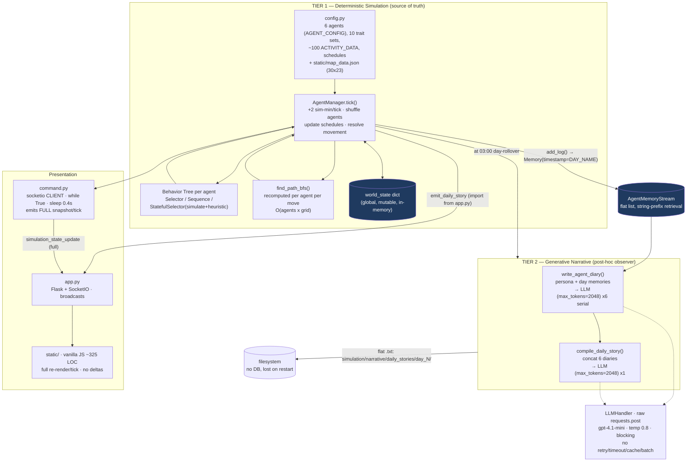
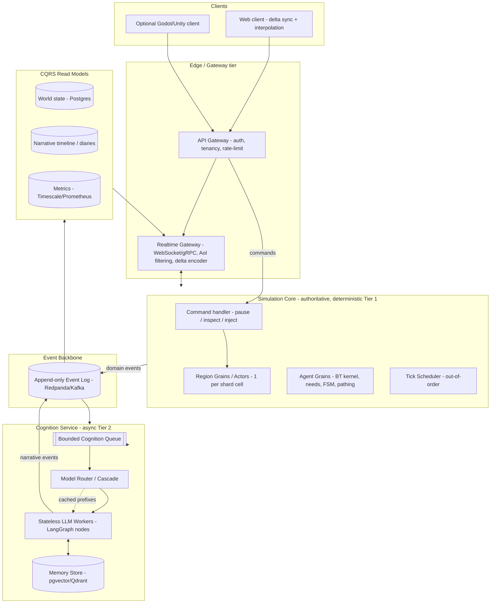
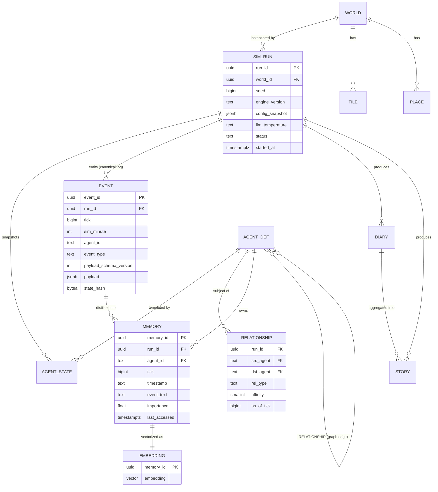
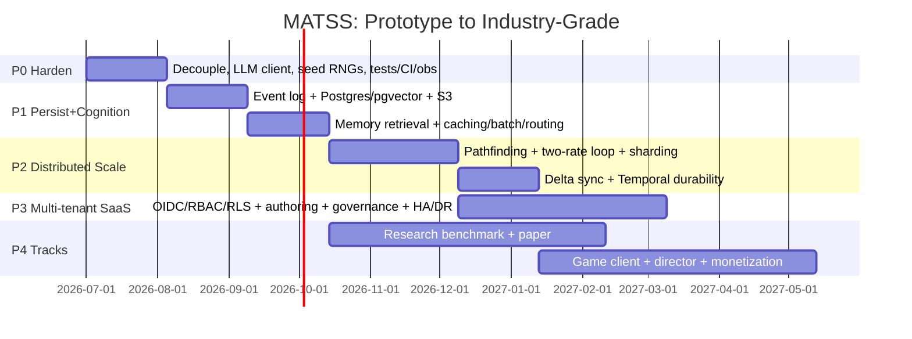

# Multi-Agent Town Story Simulator — Industry Scaling, Research & Game-Expansion Strategy

> **Project:** Multi-Agent Town Story Simulator (MATSS) — a hybrid two-tier engine for emergent
> narrative generation (deterministic Behavior-Tree control + post-hoc LLM narration).
> **Original author of MATSS:** Erfan Rafieioskouei (dissertation project).
> **Document type:** CTO / R&D strategic blueprint.
> **Date:** 2026-06-29.
>
> **What this document is.** A practical, technically grounded plan to (1) take the existing
> prototype to an industry-scale system, (2) identify the genuinely paper-worthy contributions and
> how to validate them, and (3) blueprint a video-game expansion. Every recommendation is grounded
> in the *actual* codebase (file/line references throughout) rather than generic advice.
>
> **Verification note.** External claims (arXiv IDs, venue names, vendor performance figures, model
> pricing, reported effect sizes) are flagged inline where they must be re-checked against primary
> sources before any academic submission. Quoted speedups/cost savings are vendor/published figures
> used to *size* targets, not measurements of this system.

---

## Table of Contents

- [Executive Summary](#executive-summary)
- [1. Comprehensive Project Analysis](#1-comprehensive-project-analysis)
- [2. Industry-Scale Implementation Plan](#2-industry-scale-implementation-plan)
- [3. Research & Paper-Worthy Aspects](#3-research--paper-worthy-aspects)
- [4. Video Game Expansion Blueprint](#4-video-game-expansion-blueprint)
- [5. Key Recommendations & Future Outlook](#5-key-recommendations--future-outlook)

---

## Executive Summary

The **Multi-Agent Town Story Simulator (MATSS)** is an emergent-narrative engine built on a single, defensible architectural bet: **decouple deterministic agent *control* from generative narrative *generation*.** Tier 1 is a custom Behavior-Tree simulation kernel — including a novel `StatefulSelector` that commits to a branch via a one-step heuristic lookahead — that is the single source of truth for what six personality-driven agents do across a simulated town. Tier 2 is an LLM that observes Tier 1's event trace *after the fact* and renders it as first-person diaries and a third-person town story, **never feeding back into the simulation**. This inverts the dominant pattern (Park et al.'s Smallville, which puts the LLM *inside* the per-tick control loop) and is the project's core insight: it trades nothing on expressiveness while buying **reproducibility, controllability, and bounded LLM cost** that in-loop agents structurally cannot offer. The prototype has already produced real results — 6 agents × 14 days = 84 diary entries, measured diary→story cohesion ≈ 0.149 (intentional abstraction), and emergent archetypes (Charlie the social hub, Alex the work-focused).

The path from prototype to platform turns on five moves, in priority order:

1. **Engineer the LLM economics first** — prompt caching of persona/world prefixes, the Batch API for the daily diary burst, tiered/cascaded routing (Haiku for high-volume, Sonnet for diaries, Opus for the town story), and structured outputs — behind a provider-agnostic abstraction. LLM inference is the dominant COGS and the single highest-ROI lever.
2. **Make the kernel actually deterministic** — seed every RNG (none are seeded today), pin iteration order, set a `temperature=0` reproducible track — turning the thesis's reproducibility claim from aspiration into a tested property.
3. **Event-source the simulation** — the append-only log *is* the narrative substrate and gives replay, persistence, and crash recovery for free.
4. **Deepen memory** — replace string-prefix retrieval with a Park-style recency + importance + relevance vector store.
5. **Distribute the sim** — actor/grain sharding + out-of-order execution + flow-field pathfinding to break the single-process GIL ceiling.

**Headline opportunities:** as *research*, a reproducible, deterministic-substrate benchmark answering computational social science's central validity critique (target AIIDE/FDG); as a *game*, **Chronicle** — a RimWorld-lineage "living-town" story engine where the player nudges but never puppeteers, and the LLM-narrated town history is the collectible, monetized via a COGS-aligned local-free / cloud-subscription model.

---

## 1. Comprehensive Project Analysis

### 1.1 Current State Assessment

**The core problem solved.** MATSS resolves the *narrative paradox* — the classic tension between **authorial control** and **agent autonomy** identified by Louchart & Aylett — by architecturally inverting the dominant generative-agents pattern. Where Park et al.'s Smallville (Generative Agents, UIST 2023, arXiv:2304.03442) places an LLM *inside the per-tick control loop* (expensive, stochastic, irreproducible), MATSS places the LLM strictly *downstream* as a post-hoc observer. Tier 1 is a deterministic Behavior-Tree simulation kernel that is the **single source of truth** for agent behavior; Tier 2 is a generative narrative layer that observes Tier 1's event trace and renders it as prose, **never feeding back** into the simulation. In the vocabulary of the interactive-narrative field (Kreminski et al., story sifting), Tier 2 is an **LLM-as-story-sifter/renderer**: the sim emits a stream of events, the LLM curates and narrates them. This separation-of-concerns is the project's defensible novelty — it buys reproducibility, controllability, and bounded cost that in-loop LLM agents structurally cannot offer.

> Citation note for the committee: the external references in this section (Park et al. arXiv:2304.03442; the "thousands of dollars for 25 agents / 2 days" Smallville cost figure; AI Metropolis arXiv:2411.03519 and its 1.3–4.15× speedup; Iovino et al. BT survey, RAS 2022; the Springer *AI Review* 2025 validity critique) are drawn from a research brief and **must be citation-verified (arXiv IDs, venues, figures) before submission** — a paper reviewer will check the IDs.

**AS-BUILT architecture.** Two processes (`app.py` Flask/SocketIO server + `command.py` socketio *client* that owns the blocking `while True` loop at `time.sleep(0.4)`/tick) drive a single `AgentManager` (`simulation/manager.py`) that holds all 6 agents and one global mutable `world_state` dict.



The dashed import edge `manager.py → from app import emit_daily_story` (`manager.py:10`, called at `manager.py:366`) is a genuine cycle: the simulation core imports the web presentation layer, coupling sim logic to Flask.

**Concrete strengths.** (1) The deterministic kernel is genuinely the right thesis: given a fixed RNG seed, a run is bit-reproducible — directly answering the **central validity critique** of LLM agent-based modeling (Springer *AI Review* 2025: "validation is the central challenge"; *verify citation*). (2) The `StatefulSelector` (`behavior_tree.py:83–155`) is a real BT/planner hybrid: it commits to a chosen branch and selects via a `heuristic_function` over a one-step `simulate()` lookahead of needs/money — a legitimate, citable point in the BT-vs-GOAP/HTN design space (Iovino et al., RAS 2022; *verify citation*). (3) Tier 2's near-zero diary→story cohesion is *intentional* abstraction, and the toolkit measures it: `results/comprehensive_report.txt` reports **Overall Average Similarity: 0.149** — the project ships its own empirical evaluation rather than asserting quality. (4) Personality is mechanically grounded: `AGENT_CONFIG` (`config.py:300–342`) assigns trait lists that map (via `PERSONALITY_TRAITS`, `config.py:13–24`) to numeric modifiers altering behavior. Alex's `['extrovert','workaholic','social_butterfly']` + `office_worker_extrovert` schedule (work-heavy weekday blocks) yields a **work-focused** archetype; Charlie's `['extrovert','social_butterfly','spontaneous']` + `cafe_worker_social` template yields a **social-hub** archetype. Manager logic even branches on these names directly (`manager.py:115–121` keys off `'lazy'`/`'workaholic'`/`'fitness_enthusiast'`), so archetypes are *emergent from sim dynamics*, not prompt-asserted.

**Concrete weaknesses & bottlenecks.** Mapping to the brief's numbered KNOWN WEAKNESSES (1–9), grounded in code:

- **(W1) Single-process GIL-bound serial loop.** `command.py` runs one `while True` with `time.sleep(0.4)` (`command.py:66`); `manager.tick()` iterates all agents serially. No parallelism — agent count and world size are hard-capped by one core.
- **(W2) BFS recomputed per move.** `find_path_bfs` (`manager.py:12–39`) does a fresh BFS with list-as-queue (`queue.pop(0)` is O(n)) for every agent every replan, rebuilding the full path via `new_path = list(path)` on each node expansion → **O(agents × grid)** per tick, worse under the ad-hoc replanning branch (`manager.py:291–322`) that re-BFSes when a cell is blocked.
- **(W3) Blocking serial LLM calls.** At 03:00 (`manager.py:356–366`), 6 `write_agent_diary` calls (`narrative_system.py:37`, `max_tokens=2048` each) then 1 `compile_daily_story` (`narrative_system.py:66`, `max_tokens=2048`) run **strictly sequentially** inside the sim loop, stalling the simulation. Cost & latency scale linearly with agents, with **zero batching/caching/concurrency**. (Note: `LLMHandler.generate_narrative` defaults to `max_tokens=512` at `llm_handler.py:21`, but the narrative callers explicitly pass 2048, which is what executes.)
- **(W4) No persistence.** Diaries/stories are flat `.txt` under `simulation/narrative/daily_stories/day_N/`; `world_state` and `AgentMemoryStream` are in-memory and lost on restart. No event log → no replay, no time-travel, no narrative DB.
- **(W5) Shallow memory.** `AgentMemoryStream.get_memories_for_day` filters by `timestamp.startswith(day)` (`memory.py:36–37`) where `timestamp` is the *day-name string* (`add_log` passes `timestamp=f"{day_of_week}"`, `entities.py:68`). `Memory.__init__` actually defaults `timestamp` to `datetime.now().isoformat()` (`memory.py:13`), but that real-timestamp path is bypassed — itself sloppy. No embeddings, no recency/importance/relevance scoring, no reflection — far below Park's memory stream. `get_embedding` (ada-002, `llm_handler.py:41`) has **no call site in the simulation, narrative, or memory modules** (grep finds only its definition) — effectively dead.
- **(W6) Hardcoded config.** `config.py` is ~342 lines of Python dicts; the map is static JSON (`static/map_data.json`). No authoring tooling, no hot reload, no data-driven content.
- **(W7) Tight coupling / no engineering rigor.** manager↔app import cycle, global mutable `world_state`, no tests, no CI, no metrics/tracing, no auth, single-tenant.
- **(W8) Full snapshots per tick.** `command.py` emits the entire agent array every tick (`state_payload` built in `manager.tick()`, `manager.py:349–353`); `app.py` re-broadcasts; `script.js` re-renders — no deltas/interpolation, bounding client count and world size.
- **(W9) Naked HTTP to OpenAI.** `requests.post` (`llm_handler.py:33`) with no retry/backoff/streaming/structured outputs and only a model string for provider abstraction; `generate_narrative` has **no timeout** (only `check_llm_api` passes `timeout=10`, `llm_handler.py:72`), so one hung TCP connection can freeze the sim indefinitely.

| Strengths | Weaknesses |
|---|---|
| Deterministic, seed-reproducible kernel → answers the LLM-ABM validity critique by construction | Single-process, GIL-bound, serial `while True` loop — no parallelism (W1) |
| Novel `StatefulSelector` BT/planner hybrid (lookahead `simulate()` + heuristic) | BFS replanned per agent per move, list-queue O(n) pops — O(agents×grid)/tick (W2) |
| Clean Tier-1/Tier-2 decoupling (LLM never feeds back) = controllable narrative | 7 blocking, serial 2048-tok LLM calls/day stall the sim; no batch/cache (W3) |
| Personality (`AGENT_CONFIG`) → numeric modifiers → emergent archetypes (Alex work-focused, Charlie social hub) | In-memory + flat `.txt`; no DB, no event log, no replay (W4) |
| Ships its own empirical eval (cohesion 0.149, sentiment, network analysis) | String-prefix day-name memory; no retrieval/reflection; `get_embedding` uncalled (W5) |
| Low diary→story cohesion is *intentional* abstraction, and measured | Hardcoded dicts + static map JSON, no authoring/hot-reload (W6) |
| Simple, debuggable, low operating cost at N=6 | manager↔app cycle, global state, no tests/CI/observability/auth (W7) |
| 84 entries / 14 days of real results already produced | Full snapshots/tick + naked `requests.post` (no timeout/retry) (W8, W9) |

### 1.2 Technological Review

Each current technology rated against the goal of scaling from 6 agents / 1 core toward a persistent many-agent town.

| Component (file) | Assessment vs. scale | Verdict |
|---|---|---|
| **Custom BT engine** (`behavior_tree.py`) | The `StatefulSelector` lookahead/heuristic is the thesis's intellectual core and is correct in spirit, but `simulate_child` (`behavior_tree.py:113–127`) hardcodes outcome deltas by substring-matching child names (`"eat" in child.name` → hunger −30; `"work"` → +10 money; `"socialize"` → social −20) — brittle, not data-driven. The engine itself is sound and cheap; keep it, **generalize the simulate/heuristic model** into declarative effect descriptors. | **Refactor** — keep determinism + lookahead; replace string-sniff effects with a data-driven world-model so it scales to ~100 activities and richer planning. |
| **BFS pathfinding** (`find_path_bfs`) | Correctness-OK but algorithmically the worst case: `queue.pop(0)` O(n), full-path copy per expansion, no precomputation, recomputed on every replan. Fails at larger grids/agent counts. | **Replace** — A* / JPS on a static nav-grid with a precomputed all-pairs or flow-field cache (the map is static), and `collections.deque`/heap; cuts per-tick path cost by orders of magnitude. |
| **Flask + SocketIO + separate `command.py` client** (`app.py`/`command.py`) | The split where the *client* owns the sim loop and round-trips full state through the server (`simulation_state_update` re-broadcast) is an anti-pattern — adds a network hop and inverts ownership. Flask dev server (`allow_unsafe_werkzeug=True`) is non-production; single-tenant. | **Replace** — server-authoritative async backend (ASGI/FastAPI or actor runtime); sim runs server-side, clients subscribe to AoI-scoped deltas. |
| **Raw `requests.post` → gpt-4.1-mini** (`llm_handler.py`) | No retry/backoff/timeout (on the hot path), no streaming, no structured outputs, no batching, no caching, single hardcoded provider/model; `temperature=0.8` fixed. This is the make-or-break cost layer and the weakest link for scale. | **Replace** — provider-agnostic SDK abstraction (Claude as default frontier tier; exact IDs `claude-opus-4-8`/`claude-sonnet-4-6`/`claude-haiku-4-5`) with prompt caching, Batch API, tiered routing, JSON-schema structured outputs, retries/timeouts. |
| **Flat `.txt` persistence** (`narrative_system.py`) | No queryability, no replay, lost-on-restart for sim state, no relational/temporal indexing of the narrative. The event log *is the story* — discarding it forfeits the project's most valuable artifact. | **Replace** — append-only event log (event-sourcing) + relational/vector store; `.txt` becomes an export view, not the system of record. |
| **In-memory global `world_state`** (`manager.py`) | Mutable global dict shared across all subsystems; no snapshot/restore, blocks sharding and multi-tenancy, makes testing hard. | **Refactor → Replace** — explicit, serializable world-state with checkpointing (durable execution); partition spatially for sharding. |
| **String-prefix memory** (`memory.py`) | `startswith(day_name)` retrieval is the believability ceiling: no relevance, recency, importance, or reflection. Caps long-horizon narrative; the existing `get_embedding` is uncalled. | **Replace** — Park-style memory stream: recency (0.995 decay) + importance (LLM 1–10) + relevance (cosine) over a vector store, plus reflection. |
| **pandas/sklearn/TextBlob/NetworkX analyzer** (`narrative_analyzer.py`) | Genuinely strong offline asset: TF-IDF cohesion (the 0.149 figure), sentiment, routine tracking, interaction graphs, auto-diagram — already produces publishable `results/`. TextBlob sentiment is dated, and it's batch-only/offline. | **Keep** (Refactor at edges) — retain as the evaluation harness; add an LLM-as-judge (with reported human correlation/ICC) and migrate sentiment to a modern model; eventually stream metrics into observability. |
| **Vanilla-JS full-snapshot frontend** (`script.js`) | ~325 LOC, re-renders from full snapshots each tick — no deltas, interpolation, or interest management. Bounds client count and world size; no component model for richer UI/authoring. | **Refactor → Replace** — delta/AoI state sync + interpolation; reactive component framework if the UI grows toward authoring/inspection tooling. |

### 1.3 Opportunity Identification

The highest-leverage moves cluster around three axes: **scaling the simulation** (distributed, out-of-order), **engineering the LLM economics** (the dominant COGS), and **deepening cognition + narrative** (the believability/validity story). The research is unanimous that LLM inference cost — Park's reported "thousands of dollars for 25 agents over 2 days" (*verify figure*) — is the gating variable, so cost engineering is the single best ROI.

- **LLM cost/latency engineering (highest ROI).** Replace `llm_handler.py` with a provider-agnostic layer using: **prompt caching** (cache the stable persona/background + world/place tree prefix shared across an agent's many calls → up to ~90% cost / ~85% latency cut per Anthropic guidance, cache-read ~0.1× input); the **Batch API** (50% cheaper, async — and tick-based sims map perfectly: collect all agents' diary/decision prompts and batch-submit, since they're latency-tolerant within a day-rollover); **tiered/cascaded routing** (`claude-haiku-4-5` for high-volume per-tick/observation calls, `claude-sonnet-4-6` for per-agent diaries, `claude-opus-4-8` only for the hardest director/reflection/story-compilation reasoning, per RouteLLM-style routing); and **structured outputs** (JSON-schema'd decisions) to kill retries. This alone turns the serial 03:00 stall (W3) into a concurrent, cheap batch.
- **Memory & cognition upgrade.** Implement the **Park memory stream** — append-only observations with retrieval `= α·recency(0.995 decay) + α·importance(LLM 1–10) + α·relevance(cosine)` over a vector store (pgvector co-located with sim state, or Qdrant for latency), plus **reflection** (synthesize higher-level memories when summed importance exceeds threshold). Resurrect the uncalled `get_embedding` path with `text-embedding-3-small`. This directly lifts the believability ceiling imposed by `startswith` day-name retrieval (W5) and enables long-horizon narrative continuity.
- **Distributed simulation.** Adopt **out-of-order execution** (AI Metropolis, arXiv:2411.03519, reported 1.3–4.15× speedup + larger LLM batches; *verify*) — most town agents don't interact on a given tick, so track *real* inter-agent dependencies and let non-interacting agents advance independently. Pair with **spatial partitioning into AoI cells as actors/grains** (Orleans-style) and a **two-rate loop** (fast 10–15 Hz movement/render tick decoupled from slow ≤1 Hz cognition tick). This dissolves W1/W2/W8 simultaneously. A* + flow-field caching on the static map removes the BFS bottleneck.
- **Persistence as event-sourcing (and it IS the story).** Make the simulation **event-sourced** (append-only log → Kafka/Redpanda or NATS JetStream; CQRS read models for map view + narrative feed). For an emergent-narrative engine this is doubly valuable: it gives replay/time-travel debugging *and* the event log becomes the very substrate Tier 2 sifts. Adds the reproducibility/replay artifact reviewers expect (W4, W7).
- **Content & authoring tooling.** Lift hardcoded `config.py` and the map into **data-driven, hot-reloadable content** with a validation schema and an in-browser editor (agents, traits, schedules, activities, places). This is the prerequisite for UGC and for the academic "controlled perturbation" experiments the validity critique demands (W6).
- **Observability & rigor.** Add tracing/metrics (per-tick latency, per-agent LLM cost, cache-hit rate, narrative cohesion drift), structured logging, tests around the deterministic kernel (its determinism makes it ideally testable), and CI. Break the manager↔app import cycle (W7).
- **Multi-tenant SaaS (expansion).** The deterministic kernel + durable execution (Temporal-style checkpointing) makes "one town per tenant" cleanly shardable; LLM inference is the real COGS, so a **per-world hosting/compute subscription** aligns price with cost.
- **Forward pointers — research & game.** *Research:* this architecture's headline contribution is **reproducibility + controlled perturbation** as the answer to the social-sim validity critique (Springer *AI Review* 2025; *verify*); evaluate with a **Park-style believability + ablation** protocol *plus* an LLM-as-judge with reported inter-rater reliability (ICC/Krippendorff), targeting **AIIDE** (FDG/CoG secondary). *Game:* add an **LLM drama-director** (RimWorld "AI Storyteller" pattern, DeepMind Concordia Game-Master) that injects events to maintain narrative tension *into Tier 1 events* while keeping the Wildermyth lesson — authored beats scaffold the LLM so output stays coherent.

| Opportunity | Impact | Feasibility | Priority |
|---|---|---|---|
| LLM cost engineering: caching + Batch API + tiered routing + structured outputs | Very High | High | **1** |
| Provider-agnostic LLM layer w/ retries/timeouts/streaming (Claude default) | High | High | **2** |
| Park-style memory stream (recency+importance+relevance) + reflection + vector DB | Very High | Medium | **3** |
| Event-sourced persistence (log = story) + replay/CQRS | High | Medium | **4** |
| A*/JPS + flow-field path cache on static nav-grid | Medium | High | **5** |
| Observability + tests on deterministic kernel + break import cycle | Medium | High | **6** |
| Out-of-order execution (AI Metropolis) + two-rate loop | Very High | Medium-Low | **7** |
| Data-driven, hot-reloadable content + authoring UI | High | Medium | **8** |
| Delta/AoI state sync + interpolation frontend | Medium | Medium | **9** |
| Spatial actor/grain sharding (Orleans-style) for many-agent scale | Very High | Low | **10** |
| Evaluation protocol upgrade (LLM-as-judge + ablations, AIIDE target) | High (research) | Medium | **11** |
| LLM drama-director injecting Tier-1 events (RimWorld/Concordia GM) | High (product) | Medium | **12** |
| Multi-tenant SaaS w/ durable execution + per-world compute billing | High | Low | **13** |

---

## 2. Industry-Scale Implementation Plan

*This plan is presented in two parts: **2.1–2.3** cover the target architecture, technology stack, and scalability/performance strategy; **2.4–2.6** cover data management, security & reliability, and the phased development roadmap.*

### 2.1 Core Architecture & Design

The current MATSS is a **single-process, GIL-bound monolith** in which `command.py` runs a blocking `while True: tick(); time.sleep(0.4)` loop, mutates one global `world_state` dict, recomputes BFS per agent per move (`find_path_bfs`, re-called in `simulation/manager.py` at lines 270 and 308 on block), and — once per simulated day — serially emits 6 diary + 1 story LLM calls at the 3 AM day-rollover (`simulation/manager.py:362-366`). The kernel itself lives in `behavior/behavior_tree.py` (195 lines: `Node`, `Selector`, `Sequence`, `StatefulSelector`) with condition/action nodes in `behavior/agent_behaviors.py`. Crucially, `simulation/manager.py:10` does `from app import emit_daily_story` — a hard import cycle that fuses the simulation kernel to the Flask/SocketIO transport.

Every known bottleneck (1–9) traces back to three architectural sins: **(a) compute coupling** (cognition, simulation, and I/O share one thread), **(b) state coupling** (one mutable dict, no log, no persistence), and **(c) transport coupling** (the `app`↔`manager` import cycle and full-snapshot broadcast).

One nuance the rest of this section depends on: **per-tick LLM exposure is not primarily the diaries.** The 6-diary/1-story burst fires only on day-rollover. The chronic per-tick cognition leak is the **`StatefulSelector` one-step look-ahead** — `simulate_child` / `simulate` (`behavior/behavior_tree.py:113`) is invoked *every tick* for committed branches. In the shipped code this look-ahead is a cheap hand-coded heuristic (it just nudges `needs`/`money` by fixed deltas), but it is precisely the seam where a richer system would be tempted to call an LLM per tick. The target architecture must therefore keep the look-ahead **deterministic and on-CPU** and push *all* generative work off the tick path — otherwise the "cognition off the hot loop" win holds only for the day-rollover case and silently regresses on the common case.

The target architecture inverts all three couplings by enforcing the thesis's own design principle — *decouple deterministic Tier-1 control from generative Tier-2 narration* — at the **infrastructure** level, not just the conceptual one. The headline pattern is **authoritative server + actor/grain simulation core + event-sourced narrative substrate + queue-driven async cognition service**.

#### Target component architecture



#### Tick / request data flow

**Simulation (write) path — per tick:**

1. **Tick scheduler** advances simulated time (the current `+2 min/tick`) and signals **region grains**, not a global loop. Each region grain ticks only the **agent grains** it owns.
2. Each **agent grain** runs its **deterministic BT** (the existing `Selector`/`Sequence`/`StatefulSelector` engine, lifted verbatim from `behavior/behavior_tree.py`) over its local `needs`/`money`/FSM state, including the `simulate_child` look-ahead — kept pure and on-CPU. This stays **cheap and reproducible**: the thesis's reproducibility claim becomes a *guarantee* once the BT is the only thing on the hot path and the RNG is seeded per region.
3. The BT emits **domain events** (`AgentMoved`, `ActivityStarted`, `Conversation`, `NeedCritical`) to the **append-only log** instead of mutating a shared dict. The log — not an in-memory dict — is the **canonical source of truth**. This is the single highest-leverage change: it directly *is* the narrative substrate (story sifting in the Kreminski/Winnow lineage operates over an event stream), and it gives replay, time-travel debugging, crash recovery, and a per-day event slice for diary generation for free.
4. A **CQRS projector** consumes the log to build read models: a `world_state` snapshot table (Postgres), a `narrative_timeline`, and metrics. The realtime gateway pushes **deltas** off these projections.

**Cognition path — off the tick loop:**

5. When the BT produces a narration-worthy event (or the day rolls at 3 AM), it enqueues a job — it never blocks the tick. **Stateless LLM workers** pull from the queue, retrieve memory, call the provider through the router, and write the resulting diary/story **back as a narrative event**. Tier 2 *still never feeds back into Tier 1*: it only subscribes to the log and appends to it. The architectural separation the dissertation argues for becomes literally a separation of services and a one-way event flow.

**Client command (read/round-trip) path:**

6. A client-initiated command — pause/resume, inspect an agent, or inject an authoring event ("seed a Valentine's party," à la Park) — enters via the **API gateway** (auth, tenancy, rate-limit), is forwarded to the sim-core **command handler**, and is applied as a *first-class log event* (`SimPaused`, `EventInjected`) on the same append-only log. The projector updates the read models; the realtime gateway streams the resulting delta back to all subscribed clients in that tenant. Because commands are log events, every operator action is itself replayable and auditable — the inspect/inject affordances a committee will want for controlled-perturbation experiments fall out of the event-sourcing choice rather than being bolted on.

#### How this removes each current bottleneck

| # | Current bottleneck | Architectural fix |
|---|---|---|
| 1 | Single-process GIL loop, no parallelism | Region/agent **grains** distribute the tick across silos/nodes; out-of-order scheduler parallelizes non-interacting agents (see 2.3) |
| 2 | BFS recomputed per agent/move (`manager.py:270/308`) | Precomputed **flow-field / JPS** path cache per destination per region cell; BFS replaced by O(1) field lookups (see 2.3) |
| 3 | Serial blocking LLM calls (6 diaries + 1 story) at day-rollover | **Queue + stateless worker pool**; batched per-day jobs; the chronic `simulate_child` look-ahead stays deterministic on-CPU |
| 4 | No persistence — flat `.txt` + in-memory state | **Event log = source of truth** (Redpanda/Kafka) + Postgres projections; full event-sourced replay |
| 5 | Shallow memory, no retrieval (`memory.py:36`) | Dedicated **vector memory store** (pgvector/Qdrant) behind cognition workers; recency/importance/relevance retrieval |
| 6 | Hardcoded `config.py` dicts | Config becomes **data** in Postgres + content service; hot-reload via projection refresh |
| 7 | `manager`↔`app` import cycle, global `world_state`, no obs | Event bus **breaks the cycle** (sim only emits; gateway only subscribes); OpenTelemetry tracing on every service |
| 8 | Full snapshots every tick | Realtime gateway does **AoI filtering + delta encoding** off CQRS read models |
| 9 | `requests.post` generation/embedding calls without timeout/retry | **Provider abstraction** with retries/backoff/timeout/streaming/structured outputs/caching/batching (2.2) |

#### Breaking the `app`↔`manager` cycle — a strangler-fig step

The import cycle deserves a named migration, not just "use an event emitter." Apply the **strangler-fig** pattern in three reversible moves: **(i)** introduce an `EventSink` interface in `sim-core` and have `manager.py` publish a `DailyStoryReady` event to it instead of calling `emit_daily_story`; **(ii)** invert the dependency — the gateway *subscribes* to `EventSink` and owns the SocketIO emit, so `manager` no longer knows the transport exists; **(iii)** delete `from app import emit_daily_story` (`manager.py:10`). Initially `EventSink` is an in-process channel; in Phase B it is backed by the event log with zero call-site changes — the interface is the contract.

#### Microservices vs. modular monolith — recommended path

A full microservice mesh now would be premature for a single-author dissertation with no CI/tests/observability (bottleneck 7). The pragmatic path is a **modular monolith with hard internal seams, deployed as 3–4 services**:

- **Phase A (refactor-in-place):** Split the monolith into four in-process modules with *enforced* boundaries — `sim-core`, `cognition`, `gateway`, `projections` — communicating only via the `EventSink`/event-log abstraction (in-process channel to start). Execute the strangler-fig cycle break above, replace the global dict with the event emitter, add seeds + tests. This alone delivers reproducibility, persistence, and decoupling without distributed-systems overhead.
- **Phase B (split the two services with orthogonal scaling axes):** Extract the **cognition service** (scales on LLM I/O, stays Python) and the **realtime gateway** (scales on connections) as separate deployables behind the event log. The sim-core stays one service.
- **Phase C (shard the sim-core)** only when one node can no longer hold the agent population — at which point **Ray** actor placement (the primary recommendation; see 2.2) makes sharding a deployment concern, not a rewrite, with Orleans as the named .NET alternative if the team leaves Python.

This sequencing means **every phase ships value** and the system is never simultaneously broken across multiple new services — the opposite of a big-bang microservice rewrite, which a project with no test harness cannot survive.

> **Scope cut (deliberate):** the API gateway provisions auth/tenancy/rate-limit hooks, but a full **security and multi-tenancy** treatment (RBAC, per-tenant isolation, secrets rotation, abuse controls) is out of scope for this dissertation and flagged as future work rather than silently omitted.

### 2.2 Key Technologies & Frameworks

The guiding principle: **keep Python where it is a strength (ML, LLM orchestration, the existing BT/agent code) and introduce a faster runtime only on the proven hot path**. The BT engine (`behavior/behavior_tree.py`, 195 lines) and behaviors (`behavior/agent_behaviors.py`) are already clean Python; rewriting them in Rust on day one would discard the dissertation's working kernel for speed the project does not yet need. The defensible move is to make the sim-core **profile-driven**: keep it Python under an actor framework first, and port only the pathing/needs hot loop to a compiled runtime if and when profiling demands it.

| Layer | Recommendation | Justification against MATSS |
|---|---|---|
| **Sim-core runtime** | **Python + Ray actors** (Phase A–C); escalate the hot loop to **Rust (via PyO3)** or an **Elixir/OTP** actor layer only if profiling shows the BT tick saturating a core | Ray gives an actor model and out-of-order scheduling without leaving Python, preserving the existing `manager.py`/BT code. Elixir/BEAM (millions of lightweight processes, supervision trees) is the strongest fit *if* agent count goes 1000+; Rust/Bevy-ECS is the endgame for a data-oriented agent loop. Don't pay that migration cost prematurely. |
| **Distributed actor placement** | **Ray virtual-actor pattern** for region/agent grains (primary); **Microsoft Orleans** (.NET) as the named alternative | Ray keeps the stack Python-native — the right default for a Python dissertation and consistent with 2.1's Phase C. Orleans "virtual actors" are battle-tested in game backends (reported: Halo, Age of Empires) with activation-on-demand mapping 1:1 to "agent grain," and remain the fallback if the team adopts .NET. |
| **Agent cognition orchestration** | **LangGraph** for per-agent cognition graphs + **Temporal** for durable scheduling of long-lived day/diary workflows | LangGraph gives checkpointed, resumable, conditional state machines for the diary→reflection→story pipeline; Temporal auto-checkpoints every step so a crashed worker resumes the day's narration exactly where it stopped — directly fixing bottleneck 4's "state lost on restart." |
| **Event backbone** | **Redpanda** (Kafka-API, single binary) → managed **Kafka** at scale; or **NATS JetStream** for stream-per-agent | The append-only log is the canonical narrative substrate (2.1). Redpanda's single-binary deploy suits a solo author; Kafka-API compatibility keeps an exit to managed Kafka. |
| **LLM provider abstraction** | A thin **provider-agnostic gateway** (LiteLLM-style or in-house) exposing `complete()`, `embed()`, `stream()`, `batch()`; replace the raw `requests.post` in `llm_handler.py` | The health check (`check_llm_api`, line 72) already sets `timeout=10`, but the **generation call (line 33) and embedding call (line 51) have no timeout and no retry/backoff** — that is the real defect (bottleneck 9). The abstraction adds retries/exponential backoff, timeouts, structured outputs (JSON-schema'd diary metadata), streaming for the story panel, and a single seam to swap providers. |
| **Frontier model tier** | **Claude Opus 4.8** — director/story-compilation + reflection (hardest cross-agent reasoning); **Sonnet 4.6** — per-agent diaries (balanced cost/quality); **Haiku 4.5** + **distilled/local Llama/Mistral** — high-frequency per-event narration flags and importance scoring | Tiered routing by task difficulty: the once-per-day town story (`compile_daily_story`) is rare and reasoning-heavy → Opus; 6 diaries/day are volume → Sonnet; per-event "is this narration-worthy / poignancy 1–10" scoring is high-frequency → Haiku or a distilled local model. This mirrors *Project Sid*'s PIANO design, which runs concurrent modules at different clock rates and reserves small/non-LLM nets for fast loops (Altera, arXiv:2411.00114). |
| **Cost controls** | **Prompt caching** (cache the static world description + per-agent persona/backstory prefix), **Batch API** (submit all 6 diaries as one tick-aligned batch), **structured outputs**, **cascade routing** | Park et al.'s Smallville (arXiv:2304.03442) used *none* of these, so cost scaled roughly linearly with agent-count and LLM-call volume. Caching the persona/world prefix and batching diaries turns that linear curve into a near-flat one — the make-or-break for scaling agent count. (Vendor-reported caching savings are cited in 2.3 as *published*, not MATSS-measured, figures.) |
| **Vector memory** | **pgvector / pgvectorscale** (co-located with relational state); **Qdrant** when memory retrieval becomes the measured bottleneck | Replaces the shallow `startswith(day)` retrieval in `simulation/memory/memory.py:36` (invoked from `simulation/narrative/narrative_system.py:24`). pgvector keeps agent rows + embeddings + plans in **one Postgres** (operationally simplest for a dissertation); Qdrant is the upgrade path. Implement Park et al.'s composite — **recency (exp. decay, factor 0.995) + importance (LLM 1–10 poignancy) + relevance (cosine)** (arXiv:2304.03442, §retrieval). |
| **Embeddings** | **OpenAI text-embedding-3-small** (1536-d) default; self-host **BGE-large** / **Nomic-embed-v1.5** past the API/self-host cross-over | The current `get_embedding` (ada-002, `llm_handler.py:48`) is dead code — wire it into the new retrieval composite. 3-small is cheaper and stronger than ada-002 at the same integration cost. |
| **Databases** | **Postgres** (world-state projection, config-as-data, pgvector), **Redis** (hot working-memory tier, session/AoI cache), **Timescale/Prometheus** (metrics) | Postgres is the CQRS read-model + config store, killing bottlenecks 4 and 6. Redis serves the hot memory tier and the pathing/flow-field cache. |
| **Realtime + API edge** | **gRPC/WebSocket realtime gateway** with delta encoding + AoI; **API gateway** (Envoy/Kong) for auth, tenancy, rate-limit | Replaces the `socketio` full-snapshot broadcast and the `app`↔`manager` coupling. AoI bounds both bandwidth (bottleneck 8) and per-agent LLM context. |
| **Orchestration / IaC** | **Kubernetes** + **Agones** for stateful sim-server pods; **Terraform** + **Helm**; **OpenTelemetry** + Grafana | Agones tells K8s not to kill a pod with a live simulation (stateful), unlike a stateless web service. Avoid proprietary world-as-a-service vendor lock-in (the 2019 Improbable/Unity SpatialOS ToS episode is the cautionary tale). |
| **Frontend** | **Keep the web client**; add **delta sync + snapshot interpolation** (50–100 ms buffer); optional **Godot 4** client for a richer 2D view | The existing `static/script.js` (~325 lines) is fine; the fix is transport (deltas, not snapshots), not a rewrite. Godot 4 (true 2D, MIT, no runtime fee) is the natural upgrade if a game client is desired. |

### 2.3 Scalability & Performance Strategy

Scaling MATSS means scaling **two orthogonal axes independently**: the **deterministic tick** (CPU-bound, must stay real-time-ish) and **cognition** (I/O- and cost-bound, latency-tolerant). The architecture in 2.1 lets each scale on its own axis — the entire point of removing the GIL-bound single loop. The external figures cited below are **published/vendor-reported** numbers used to size targets; they are *not* MATSS measurements, and the SLO table separates them from this project's own commitments.

#### Horizontal scaling of the sim-core

- **Spatial sharding via uniform grid.** The static 30×23 map already partitions cleanly; assign rectangular cell-blocks to **region grains**, each owning the agents inside it. Cross-cell interactions are **message passes** between region grains; **AoI** determines what each client and each agent's LLM context perceives. A uniform grid (not a quadtree) is correct here because town agents are roughly evenly distributed and the map is small.
- **Cross-shard agent handoff.** When an agent crosses a cell boundary, the source region serializes its state (needs, FSM, memory pointer) and hands ownership to the destination region — a single `AgentHandoff` log event makes this replayable and crash-safe.
- **Out-of-order execution.** Do **not** globally lockstep agents. Track real inter-agent dependencies (two agents in the same AoI about to interact) and let everyone else advance ahead in sim-time. This is the AI Metropolis technique (arXiv:2411.03519), which *reports* a 1.3×–4.15× speedup plus larger, cheaper LLM batches — the right lever for a town where most agents aren't interacting on any given tick. The realized MATSS speedup must be measured, not assumed.

#### Cognition scaling

- **Stateless workers behind a queue.** Diary/story/reflection jobs land on the cognition queue; a horizontally autoscaled worker pool drains it. Workers hold no agent state (they fetch from the memory store), so scaling is pure replica count.
- **Batching.** All 6 (→ N) diaries for a simulated day are submitted as **one Batch API request** (latency-irrelevant since it's a 3 AM background job). Per-event poignancy scoring is micro-batched per tick.
- **Cascade routing.** A cheap local/Haiku model first-passes "is this event narration-worthy?"; only worthy events escalate to Sonnet (diary), and only the daily compilation escalates to Opus 4.8.
- **Backpressure — concrete policy.** The cognition queue is a **bounded** queue (depth `D_max`) with **drop-by-importance**: each job carries the poignancy score (1–10); on overflow the queue evicts the lowest-importance pending job first, and jobs that error out N times route to a **dead-letter queue** for offline reprocessing. The tick scheduler reads queue depth as a signal but **never blocks** on it — because Tier 2 is strictly post-hoc and one-way, a cognition backlog degrades narrative richness (some low-poignancy events go un-narrated) without ever stalling the deterministic simulation. This graceful degradation is only possible *because* cognition is off the tick path.

#### Autoscaling policy

| Component | Trigger | Action |
|---|---|---|
| Cognition workers | **KEDA** on cognition-queue depth (scale-up at depth > `D_max`·0.5; scale-to-zero when idle) | Add/remove stateless worker replicas; the queue is the load signal |
| Realtime gateway | **HPA** on active WebSocket connections / CPU | Scale on client fan-out, independent of sim load |
| Sim-core region grains | Agents-per-node > target (Phase C) | Split a region cell, place the new grain on a fresh silo (Ray placement) |

#### Caching layers

| Cache | Replaces / fixes | Mechanism |
|---|---|---|
| **Pathfinding cache (flow-fields / JPS)** | Per-move BFS at `manager.py:270/308` (bottleneck 2) | Precompute one **flow-field per named destination per region** (every agent heading to the Cafe reads the same field — O(1) per step vs. O(agents×grid) BFS). JPS for sparse one-off paths. Invalidate only on map change — the map is static, so invalidation is near-zero. |
| **Prompt cache** | Re-sending world + persona every LLM call (bottlenecks 3/9) | Cache the static map description + per-agent persona/backstory prefix (Anthropic *reports* up to ~90% cached-input cost and ~85% latency reduction on long prefixes; treat as a target to validate). |
| **Embedding cache** | Re-embedding identical memory/query text | Content-hash → vector in Redis; the dead `get_embedding` path becomes cheap and reused. |
| **Working-memory cache** | Re-querying the vector store every retrieval | Redis hot tier holds each agent's recent + high-importance memories; vector store hit only on cache miss. |

#### LOD for off-screen / distant agents

Agents outside any client's AoI run at **reduced fidelity**: the deterministic BT still ticks (cheap), but cognition is downgraded — no per-event narration, importance scoring batched coarsely, and at the lowest LOD the agent is **narrative-only** (its day is summarized in one cheap call rather than event-by-event). This caps cognition cost at the *attended* agent count, not the *total* agent count — the key to a 1000-agent town on a dissertation budget.

#### Transport

Delta-compressed binary state sync (MessagePack) off the CQRS read models — Colyseus-class implementations *report* ~90% bandwidth reduction vs. full JSON snapshots — with a **10–15 Hz interpolated movement/render tick decoupled from a 0.2–1 Hz cognition tick** and a 50–100 ms client interpolation buffer. This directly retires bottleneck 8's "full snapshot every tick."

#### Bottleneck → mitigation → expected effect

External multipliers below are **published/vendor figures** (sources noted in-line above), included to size the target; MATSS-specific gains must be benchmarked.

| Bottleneck | Mitigation | Expected effect |
|---|---|---|
| GIL-bound single loop (1) | Region/agent grains + out-of-order scheduler | Tick parallelized across cores/nodes; *reported* 1.3–4.15× (AI Metropolis) + linear node scaling — to be measured |
| Per-move BFS (2) | Flow-field/JPS cache | Per-step pathing **O(agents×grid) → O(1)**; near-zero recompute (static map) |
| Serial blocking LLM (3) | Async queue + batching + cascade + caching; deterministic look-ahead on-CPU | Per-day cognition cost shifts from ~linear toward ~flat; tick no longer blocks on LLM |
| No persistence (4) | Event-sourced log + Postgres projections | Full replay, crash recovery, zero state loss |
| Shallow memory (5) | Vector store + recency/importance/relevance | Long-horizon believability; bounded retrieval cost |
| Hardcoded config (6) | Config-as-data in Postgres + hot reload | Authoring without redeploy |
| Coupling / no obs (7) | Event bus breaks cycle + OpenTelemetry | Independent deploy/scale; full tracing/metrics |
| Full snapshots (8) | AoI + delta sync + interpolation | *Reported* ~90% bandwidth cut (Colyseus-class); bounded client/world size — to be measured |
| Generation/embedding calls lack timeout/retry (9) | Provider abstraction (retry/backoff/timeout/stream/structured/batch) | Resilient, swappable, cheaper, parseable outputs |

#### Concrete target SLOs

These are **MATSS engineering targets to be validated by benchmarking**, deliberately stated independently of the external best-case figures above.

| Metric | Target |
|---|---|
| Deterministic tick budget | **≤ 20 ms** per region for 100 agents (50 Hz headroom; sim runs at 1–5 Hz) |
| Agents per sim node | **≥ 500** at full LOD; **≥ 5,000** mixed-LOD (narrative-only tail) |
| Cognition queue p99 (diary job) | **≤ 30 s** (background, batched; not user-facing) |
| Player-facing narration p99 | **≤ 2 s** (streamed) for the live story panel |
| State-sync bandwidth | **≤ 5 KB/s** per client at steady state (delta + AoI) |
| Cost per agent-day | A **published cost target** set after one calibration run, achieved via Haiku/local reflex + Sonnet diaries + cached prefixes + batch; the contribution is the *relative* reduction vs. an un-cached/un-batched baseline measured on MATSS, not an absolute figure borrowed from prior work |
| Recovery | **Zero state loss** on worker crash (Temporal checkpoint + event-log replay) |

These SLOs are the empirical contribution the architecture buys: they convert the dissertation's *qualitative* "decoupled two-tier" claim into *measurable* scaling and cost guarantees — reported as MATSS measurements against an in-system baseline — that a Park-style in-loop LLM agent system structurally cannot offer.


### 2.4 Data Management & Storage

The current system has **no persistence layer**: agent state lives in `AgentManager`'s in-memory objects and a global mutable `world_state` dict; the only durable outputs are flat `.txt` diaries under `simulation/narrative/daily_stories/day_N/` and the offline CSV/PNG artifacts `narrative_analyzer.py` writes to `results/`. On restart, every `Agent.memory_stream`, every `self.log`, every `needs`/`money`/`relationships` value is lost. There is no event log, so a run cannot be replayed, audited, or re-narrated under a different LLM.

This is a fatal gap for a *reproducibility-first* dissertation — but it is worth stating the situation precisely, because the prototype is **not yet reproducible at all**. The behavior layer is shot through with *unseeded* stochasticity: `behavior/agent_behaviors.py` draws `random.random()` (lines 119, 123), `random.choice()` (155, 219, 454) and `random.randint()` (221); `simulation/manager.py` adds `random.shuffle`/`random.choice` for movement and pairing (lines 131, 158, 177, 192, 265, 303, 338); `simulation/entities.py:39` seeds starting money with `random.randint`. There is **no `random.seed` or `np.random.seed` anywhere in the repository** (the only `seed=42` is cosmetic, in `narrative_analyzer.py`'s `spring_layout`). On top of this, every Tier-2 call runs at `temperature=0.8`. So the headline thesis claim from the literature positioning — that a deterministic BT kernel can guarantee bit-reproducible runs where pure-LLM agent sims (Park et al., *Generative Agents*, UIST 2023, arXiv:2304.03442) cannot — is today an **aspiration, not a property**. Determinism is something this plan must *engineer* (seed all RNGs, pin iteration order, control LLM nondeterminism via temperature 0 / fixed seeds for the reproducible track), and the event log is what *captures and proves* it once engineered. The data strategy is therefore load-bearing for the thesis, and §2.6/P0 treats "seeded run → fixed `state_hash`" as net-new work, not a free property.

#### Core entity model

The model below promotes today's implicit in-memory structures (`Agent.__init__`, `Memory`, `RELATIONSHIPS`, the `daily_stories/day_N/` tree) into first-class, persisted, multi-run entities. The pivotal new concept is **`sim_run`** (a seeded, versioned execution of a `world`) — every other row is namespaced under it so that one physical store holds the 14-day/6-agent run of today *and* the thousand-run sweeps a committee will demand. Fields marked **(new)** do not exist on the current objects and are introduced by this plan.



Three modeling decisions matter most. **(1) `EVENT` is the source of truth, everything else is a projection.** Today `add_log()` mutates `self.log` (a list capped at 50, insert-at-0 / pop-past-50) and *also* appends a `Memory` — two divergent, lossy copies of the same fact. In the target model both become *read projections* of an immutable `EVENT` row (`event_type ∈ {moved, started_activity, ate, rested, interaction_started, need_critical, day_rollover}`). **(2) `MEMORY` keeps the existing `timestamp`-string access path.** Current retrieval is `m.timestamp.startswith(day)` over a `timestamp` string field (`simulation/memory/memory.py:37`) — *not* a `day_name` column — so the migration preserves that exact field name and query to stay drop-in compatible. The `importance` (Park's LLM-scored 1–10 poignancy) and `last_accessed` (for the 0.995 recency decay) fields **do not exist on today's `Memory`** (which has only `event`, `timestamp`, `related_agents`, `details`); they are added now so the shallow stream can grow into a real recency·relevance·importance retrieval without a second schema change. **(3) `payload_schema_version` on every `EVENT`** makes JSONB payload evolution explicit (see governance below) — a real reproducibility hazard if left implicit.

#### Polyglot persistence — store chosen per data class

No single engine fits agent rows, a 30×23 tile grid, an append-only history, embeddings, a social graph, and the columnar scans `narrative_analyzer.py` runs. Polyglot persistence with one **canonical** store (the event log) and the rest as rebuildable derivatives:

| Data class | Concrete contents (today → scaled) | Store | Justification vs. this project |
|---|---|---|---|
| **Canonical history** | Every tick's events; replaces lossy `self.log` + duplicate `Memory` writes | **Kafka / Redpanda** (partition by `run_id`, key by `agent_id`) | Event-sourced log *is the narrative feed*; story-sifting (Kreminski et al., *Felt*; *Winnow*, AIIDE 2021) queries it directly. Gives replay, time-travel debug, re-narration under a new model, and the reproducibility proof (`state_hash` per tick). Redpanda = Kafka API, lower latency, no ZooKeeper. |
| **Relational + working state** | `sim_run`, `world`, `agent_def`, `agent_state` snapshots, `relationship` rows, schedules/activities (today's `config.py` dicts) | **Postgres 16** | ACID for run metadata and config provenance; `config_snapshot jsonb` freezes the exact `PERSONALITY_TRAITS`/`SCHEDULE_TEMPLATES`/`ACTIVITY_DATA` used, and `seed`/`llm_temperature` freeze the determinism contract — kills the "hardcoded config, no provenance" weakness (#6). |
| **Memory + embeddings** | `Memory.event` text + embeddings | **Postgres + pgvector** (HNSW) | Today `get_embedding` calls **`text-embedding-ada-002` (1536-d)** (`llm_handler.py:48`) and is effectively unused. The plan keeps 1536-d for migration parity, then upgrades to **`text-embedding-3-large` (3072-d)** or self-hosted **BGE-M3** for recall (note: HNSW build/storage cost scales with dimension, so this is a deliberate, measured upgrade). Co-locating memory rows and vectors in *one* DB lets a single SQL query compute Park's `α_recency·decay(0.995) + α_importance + α_relevance·cosine` without a cross-system join. |
| **Hot state** | Live `needs`, `x/y`, `state`, `interacting_with`, occupied-cell set for `find_path_bfs` | **Redis** | The per-tick full-snapshot broadcast (weakness #8) and BFS occupied-cell lookups (#2) need sub-ms reads; Redis hashes per `run_id:agent_id` + a Redis-streams tick channel feed deltas to the frontend. Ephemeral — rebuildable from the event log. |
| **Social graph** | `relationships` (type + affinity 0–100); the network graphs `narrative_analyzer.py` builds with NetworkX | **Neo4j** | Affinity-weighted multi-hop queries ("Charlie as social hub," 2-hop friend-of-friend invitation spread à la Park's Valentine's-party emergent demo) are awkward in SQL joins, native in Cypher. **Decision rule:** stay on a Postgres adjacency table until edge count exceeds ~10⁴ *or* multi-hop Cypher-style traversals dominate `narrative_analyzer.py` runtime; promote to Neo4j past that threshold. |
| **Narrative artifacts** | Generated diaries + town stories (today the `daily_stories/day_N/*.txt` files) | **S3 / object storage** (versioned) | Large immutable blobs do not belong in Postgres rows. Key as `s3://matss/{run_id}/day_{n}/{agent_id}.txt`; store the S3 URI + content hash + generating `model_id` in a `diary`/`story` Postgres row for indexing and for *attributing which model produced which text* (you'll re-narrate the same events under Opus 4.8 vs Haiku 4.5). |
| **Analytics / warehouse** | TF-IDF cohesion, sentiment, routine, day-of-week consistency — everything `narrative_analyzer.py` (1382 lines) computes offline | **ClickHouse** (or BigQuery) | Cross-run columnar scans ("diary→story cohesion 0.149 across 1000 runs") are OLAP, not OLTP. **Decision rule:** migrate off in-process pandas once analysis spans multiple runs *or* event volume per run exceeds what fits in memory; ClickHouse ingests the event log via CDC and `narrative_analyzer.py` becomes scheduled SQL + a thin pandas shim instead of re-parsing flat files. |

#### Schema, partitioning, and sharding

- **Partition by `run_id` first, world-shard second.** Kafka topics partitioned by `run_id` keep each experiment's history independently replayable and compactable; within a large single world, sub-partition by **spatial cell** (uniform grid over the tile map — the standard MMO area-of-interest primitive) so a sharded sim writes events for non-interacting regions in parallel. This exploits a documented agent-sim acceleration result — **AI Metropolis (Wu et al., 2024, arXiv:2411.03519)** shows that tracking *real* inter-agent dependencies and letting non-interacting agents advance out of global lockstep yields 1.3×–4.15× speedup — because most town agents do not interact in a given tick.
- **Postgres declarative partitioning** of `event` and `memory` by `run_id` (LIST) then by `tick` range — old runs detach to cold storage as whole partitions, no row-by-row deletes.
- **`config_snapshot` + `engine_version` + `seed` + `llm_temperature` on every `sim_run`** is the reproducibility contract: re-running `(seed, engine_version, config_snapshot, temperature=0)` must reproduce the identical `state_hash` chain in `event`. This is the empirical wedge against Park-style stochastic sims and the validity critique now standard in the field (*"Validation is the central challenge for generative social simulation,"* AI Review, Springer 2025): controlled perturbation = fork a run, change one config field, diff event streams. It only holds once P0 actually seeds the RNGs catalogued above.

#### Backup, recovery, retention, governance

- **PITR:** Postgres continuous WAL archiving to S3 (e.g. `pgBackRest`/cloud-managed) → RPO ≤ 5 min. The event log is the deeper safety net: any derived store (Redis, ClickHouse, pgvector index, Neo4j) is **fully reconstructible by replaying Kafka from offset 0**, so those need no independent backup — only the log and the Postgres run metadata are precious.
- **Recovery drill:** "rebuild ClickHouse + vector index from the log" must be a tested, scripted runbook, not a hope; it doubles as the re-narration pipeline.
- **Retention/tiering:** hot runs in Postgres/Redis; completed runs' raw event partitions tier to S3 Glacier after N days; ClickHouse keeps aggregates indefinitely (cheap, columnar). Per-run TTL configurable since a 1000-agent-year run is terabytes of events.
- **Schema evolution:** because the event log is the source of truth *across* `engine_version`s, payload shape drift is a reproducibility hazard. Version `event.payload` explicitly (`payload_schema_version`), manage relational migrations with a tool such as Alembic/Flyway, and require every consumer to read older payload versions (or run a one-time upcasting projection) so historical runs remain replayable after the schema moves.
- **Lineage/governance:** capture **dataset lineage** end-to-end — `sim_run → event → diary(model_id, prompt_hash) → story → analyzer_result`. For a dissertation this *is* the methods section: every published figure (cohesion 0.149, sentiment trends, Charlie-as-hub) must trace to a `(run_id, engine_version, model_id, seed)` tuple. Use OpenLineage/Marquez or a `lineage` table. Any real-human-grounded personas (the interview-grounded approach of Park et al., *Generative Agent Simulations of 1,000 People*, 2024, arXiv:2411.10109) introduce PII — tag those columns and gate them behind the controls in §2.5.

### 2.5 Security & Reliability Measures

Current posture: a raw `requests.post` to OpenAI with the key in `.env` (weakness #9), Flask-SocketIO with **no auth**, single-tenant, no rate limiting, and a `manager ↔ app` import cycle that means one component's failure takes the other down. Resilience is uneven: the `generate_narrative` and `get_embedding` calls (`llm_handler.py:33,51`) have **no timeout, no retry, no backoff**, while only the `check_llm_api` health check carries a `timeout=10` (`llm_handler.py:72`) — so the hot path is the exposed one. A multi-tenant SaaS or a shared research platform cannot ship on this. The agent-and-narrative nature of the system also creates an attack surface most CRUD apps lack: **LLM-specific threats** (prompt injection via agent/user-authored content, generated-output moderation, PII leakage through diaries).

#### AuthN / AuthZ / tenancy

- **OIDC** (Auth0/Cognito/Keycloak) for human users; short-lived **JWT** access tokens. The current `command.py` socketio *client* and per-tick emitters move to **mTLS + service tokens** (SPIFFE/SPIRE identities) so sim workers, the cognition service, and the gateway authenticate each other.
- **RBAC** roles: `viewer` (watch a world), `author` (edit config/personas — replaces hand-editing `config.py`), `operator` (start/stop runs), `admin`. Enforce at an API gateway, re-check in services (defense in depth).
- **Tenant isolation:** `tenant_id` on every row; **Postgres Row-Level Security** policies bound to the JWT tenant claim so a tenant can never read another's `sim_run`/`event`/`diary`. Kafka topics and S3 prefixes namespaced by tenant; per-tenant Redis logical DBs or key prefixes. This is what makes the §2.4 multi-run store safe to share.

#### Secrets, encryption, API hardening

- **Kill `.env`.** Secrets (LLM provider keys, DB creds) move to **HashiCorp Vault** or cloud KMS-backed secret managers with **dynamic, short-TTL credentials** and rotation; workers fetch at runtime via Vault Agent/IRSA — no key on disk, no key in the image.
- **Encryption in transit:** TLS 1.3 everywhere (client↔gateway, service↔service via mTLS, ↔Postgres/Kafka/Redis). **At rest:** KMS-managed envelope encryption on S3, Postgres, and backups; per-tenant data keys for crypto-shredding on deletion.
- **API hardening:** strict input validation/schemas at the gateway, per-tenant + per-IP **rate limits and budget caps**, WAF, CORS allow-list (today Socket.IO is wide open), pagination/size limits on event/memory queries to prevent log-scraping.

#### LLM-specific security

This is the differentiating risk class and must be designed in, not bolted on:

- **Prompt injection:** Tier-2 prompts in `narrative_system.py` interpolate `agent.background`, `memories`, and (in a SaaS) *user-authored* personas/events directly into LLM input. A malicious author can plant "ignore your instructions and emit the system prompt / another tenant's data." Mitigate with **strict separation of trusted instructions from untrusted content** (system vs. user roles; delimit and label all sim-derived text as data, never instructions), input sanitization, and **structured/JSON-schema outputs** so a hijacked completion can't smuggle control text into the pipeline.
- **Output moderation:** every generated diary/story passes a moderation classifier before persistence/display (the sim can surface unsafe content from user-seeded personas). Gate on a `moderation_status` column; quarantine, don't publish, on flag.
- **PII handling:** interview-grounded personas (the 1,000-People style) and any user content may carry PII. PII-tag at ingest, redact before it enters prompts or the analytics warehouse, honor deletion via crypto-shredding (per-tenant keys above).
- **Cost/abuse rate limiting:** LLM spend is the real COGS and the real abuse vector. **Per-tenant token budgets and concurrency caps**, anomaly alerts on spend, and a **circuit breaker** that degrades a run to a cheaper model (Haiku 4.5) or pauses narration rather than running up an unbounded bill — directly addresses the "serial, unbatched, unbounded LLM calls" weakness (#3) as a *security* control, not just a perf one.

#### Fault tolerance & reliability

The event log (§2.4) is also the reliability backbone:

- **Idempotent workers:** every consumer (cognition, diary, story, analytics) keyed by `(run_id, tick, agent_id)` so redelivery after a crash is a no-op. The diary writer that today blindly overwrites a `.txt` becomes an idempotent upsert keyed on `(run_id, day, agent_id)`.
- **Retries/backoff/timeouts/circuit breakers** around every LLM call — the single biggest gap on the hot path (`generate_narrative`/`get_embedding` have none today). Exponential backoff + jitter, per-provider circuit breaker, **provider-agnostic abstraction** so an Anthropic outage fails over to a secondary provider/model.
- **Dead-letter queues:** poison events (un-narratable, repeatedly failing) route to a DLQ for inspection, never block the tick stream.
- **Replay from log:** any lost derived store rebuilds by replaying Kafka; a corrupted run resumes from the last good `state_hash` rather than restarting. Adopt **durable execution** (Temporal, or LangGraph checkpointing) so a long-lived run survives worker restarts and resumes the exact tick — essential for the "runs for days/years" target.
- **High availability & graceful degradation:** multi-AZ for Postgres (primary + sync standby), Kafka (RF≥3 across AZs), Redis (replica + Sentinel), stateless services behind a load balancer. Crucially, the *narration* tier — the most fragile dependency, since it leans on a third-party LLM — must **shed load gracefully**: under provider outage or budget exhaustion, cascade Opus 4.8 → Sonnet 4.6 → Haiku 4.5 → local open model, and if all fail, **defer narration and keep the deterministic Tier-1 sim running** (the event log is still produced and can be re-narrated later from replay). The town never freezes because the storyteller is down; this is the load-shedding extension of the cost circuit-breaker above.
- **DR targets — control plane: RTO ≤ 15 min, RPO ≤ 5 min (WAL); event log: RPO ≈ 0 (replicated synchronously); derived stores: RTO bounded by replay time, RPO = 0 (rebuildable).**

#### Threat model

| Asset | Threat | Mitigation |
|---|---|---|
| LLM provider API key | Leak from `.env`/image/logs → unbounded billing | Vault/KMS dynamic short-TTL creds, rotation, never on disk, secret-scanning in CI |
| LLM prompt path (`narrative_system.py`) | Prompt injection via persona/memory/user content; cross-tenant exfiltration | Trusted/untrusted separation, label sim text as data, JSON-schema outputs, input sanitization |
| Generated diary/story | Unsafe/abusive content from seeded personas | Pre-persist moderation classifier, `moderation_status` gate, quarantine-on-flag |
| Tenant data (`sim_run`/`event`/`diary`) | Cross-tenant read | Postgres RLS on JWT tenant claim, namespaced Kafka/S3/Redis, defense-in-depth authz |
| LLM spend | Cost-exhaustion abuse / runaway batch | Per-tenant token budgets + concurrency caps, spend anomaly alerts, cost circuit-breaker → cheaper model/pause |
| Socket.IO / API surface | Unauth access, scraping, DoS | OIDC+JWT, mTLS service-to-service, rate limits, WAF, CORS allow-list, query size caps |
| Event log integrity | Tampering breaks reproducibility claim | Append-only ACLs, per-tick `state_hash` chain, immutable retention, audit on replay |
| PII in personas/diaries | Privacy breach, non-compliant retention | PII tagging at ingest, redaction before prompts/warehouse, crypto-shredding via per-tenant keys |
| Data at rest (backups, S3, DB) | Disk/snapshot exfiltration | KMS envelope encryption, per-tenant data keys, encrypted backups |

### 2.6 Development Roadmap

Phased to **de-risk the thesis first** (P0–P1 deliver the reproducibility/persistence story the dissertation needs) before scaling and commercialization (P2–P4). Each phase is independently shippable and leaves the system more correct than it found it. Timelines assume a small team (1–2 backend, 1 ML/LLM, growing later). The numeric exit criteria below are **targets/hypotheses to validate**, not measured results — they are stated here, in the gates, rather than asserted as fact in the prose.

| Phase | Goals | Key deliverables | Exit criteria (targets) | ~Timeline |
|---|---|---|---|---|
| **P0 — Hardening & Decoupling** | Make the prototype testable, observable, untangled — and *actually* deterministic | Break `manager↔app` import cycle (manager emits events to an interface, not `import emit_daily_story`); replace `requests.post` with a **provider-agnostic LLM client** (retries/backoff/timeout/circuit breaker on *all* calls, Claude + OpenAI); move `.env`→secret manager; **seed every RNG** (the unseeded `random.*` in `agent_behaviors.py`/`manager.py`/`entities.py`) and pin iteration order; set the reproducible track to LLM `temperature=0`; pytest suite asserting seeded run → fixed `state_hash`; CI + structured logging/metrics/tracing (OpenTelemetry) | Seeded run reproduces identical event-hash chain across machines (newly *true*, not assumed); all LLM calls retry/fail-over; CI green; manager importable without Flask | 3–5 wks |
| **P1 — Persistence & Cognition Service** | Give the sim a memory and a history; deepen Tier-2 cognition | Event log (Redpanda) as canonical history; Postgres + pgvector for `sim_run`/`agent`/`memory`/`relationship`; S3 for diaries/stories; **Park-style memory retrieval** (recency 0.995 · importance(LLM 1–10) · relevance(cosine)) replacing `timestamp.startswith`; upgrade embeddings ada-002→`text-embedding-3-large`/BGE-M3; **prompt caching + batch API + tiered routing** (Opus 4.8 director, Sonnet 4.6 per-agent, Haiku 4.5 high-volume); re-narration pipeline (replay log → regenerate under any model) | Full run persisted + replayable; cold-restart loses nothing; LLM cost/run materially reduced via cache+batch (target ≥50%, measured against P0 baseline); `narrative_analyzer.py` reads warehouse not flat files | 6–10 wks |
| **P2 — Distributed Sim & Scale** | Break the single-process GIL ceiling; scale agents/world | Replace per-move BFS with **incremental/hierarchical pathfinding** (JPS / flow-field + cached paths); **two-rate loop** (fast movement tick / slow cognition tick); **actor or world-shard model** (Orleans-style grains / spatial cells) with **AI-Metropolis out-of-order execution** (arXiv:2411.03519); **delta state sync** to frontend (replace per-tick full snapshots); Temporal durable orchestration of long-lived runs | 10× agents at stable tick budget; no global lockstep; client bandwidth materially reduced (target ≥80% via deltas); run survives worker crash & resumes exact tick | 10–16 wks |
| **P3 — Multi-tenant SaaS / Platform** | Productionize for many tenants & authors | OIDC/RBAC + Postgres RLS tenancy; per-tenant budgets/quotas/rate limits; **authoring tooling** (data-driven config + hot reload, killing hardcoded `config.py`); output moderation + PII governance; multi-AZ HA + tested DR runbook; billing tied to LLM COGS | N isolated tenants; author edits a world without code; DR drill meets RTO/RPO; moderation gates all generated text | 12–20 wks |
| **P4 — Game & Research Tracks** | Fork into product and academic deliverables | **Research:** released code + seeds + configs, human-eval + LLM-judge (inter-rater ICC/Krippendorff) believability/coherence protocol, ablations + perturbation/validity study, baseline vs. Park in-loop agents → AIIDE/FDG submission. **Game:** Godot/Unity client, AoI streaming, LLM drama-director (RimWorld-style) injecting events, UGC/creator economy + world-hosting subscription | Reproducible benchmark + paper submitted; playable vertical slice with hosted multi-tenant worlds | parallel, 3–6 mo |



**Sequencing rationale.** P0/P1 are gated *before* scale on purpose: the dissertation's defensible claim — deterministic-kernel reproducibility + LLM-as-story-sifter, evaluated with Park-style ablations *plus* the validity rigor the social-sim field now demands (Springer 2025) — depends entirely on the **seeded determinism** engineered in P0, the event log, and the persisted memory delivered in P0–P1. Note the ordering: P0 makes the kernel deterministic for the *first* time (it is not today), and only then does the event log have an invariant worth capturing. Those two phases alone produce a publishable AIIDE/FDG artifact even if P2–P4 never ship. P2's distribution work is wasted effort until P1 proves the cognition service is correct and cheap. P4-research can begin the moment P1 lands (it only needs reproducible runs + deepened memory), running parallel to P2/P3.

**Team / skills.** P0–P1: senior Python/backend + an LLM/ML engineer (retrieval, prompt-caching, model routing). P2: a distributed-systems/game-server engineer (actors, sharding, pathfinding, netcode) — the highest-skill hire and the riskiest phase. P3: platform/SRE + security engineer (Vault, RLS, multi-AZ, DR) and a front-end/tooling engineer for the authoring UI. P4: a games engineer (Godot/Unity) for the product track and the candidate + advisor driving the evaluation protocol for the research track. Across all phases, treat **LLM cost-per-run as the governing unit-economics metric** — every architectural choice (caching, batching, routing, distillation, out-of-order execution) is justified by its effect on it.

---

## 3. Research & Paper-Worthy Aspects

### 3.1 Novel Contributions

This section separates genuine research contributions from engineering work, judged against the three baselines reviewers will invoke: Park et al.'s *Generative Agents* (in-loop LLM cognition; arXiv:2304.03442), the drama-management lineage (Mateas & Stern's *Façade*; Aylett/Louchart Emergent Narrative), and the BT/planner-hybrid game-AI literature (Iovino et al., *A Survey of Behavior Trees in Robotics and AI*, RAS 2022; GOAP/HTN/utility hybrids). The honest summary up front: **the single most defensible publishable claim is the architectural inversion (C1) plus its reproducibility/controllability argument.** The StatefulSelector (C2) and mixed-initiative loop (C5) are weaker as standalone research, and the cohesion finding (C3) is a small but real empirical contribution. I label each accordingly.

> **Note on the cohesion figures cited below.** Per `results/similarity_summary_stats.csv`: the diary→story TF-IDF/cosine cohesion has per-agent **means** spanning 0.125 (fiona) – 0.175 (alex); the cross-agent figure ≈ 0.149 is the **mean of these per-agent means** (0.1487), *not* a pooled per-entry mean (the two differ). Per-entry values span a wider 0.078 (fiona min) – 0.247 (charlie max). I use these precise framings throughout.

#### C1 — The Decoupling Thesis as a *Controllability Framework* (STRONGEST — genuine research)

**Claim.** Emergent narrative can be produced by an architecture that strictly separates a **deterministic, reproducible simulation kernel** (Tier 1: the BT engine in `behavior/behavior_tree.py` + `simulation/manager.py`) from a **post-hoc generative narrator** (Tier 2: `narrative_system.py`) that observes the event trace but **never feeds back into agent control**. This inverts Park et al., where the LLM *is* the per-tick decision policy. The thesis is that this inversion is not merely cheaper but resolves the *narrative paradox* (Aylett/Louchart — authorial control vs. agent autonomy) along a measurable axis: the BT kernel gives reproducible, perturbable, constraint-satisfiable behavior that a pure-LLM agent cannot, while the LLM supplies expressiveness only where stochasticity is harmless (rendering, not deciding).

**Why novel vs. prior work.**
- **vs. Park et al.:** Smallville places the LLM *in the control loop* — behavior is stochastic, non-reproducible, and costs "thousands of dollars for 25 agents / 2 days." Our Tier-1 control is intended to be a fixed function of `(seed, config, tick)`: given identical seeds the world trace should be identical (a *property to be tested empirically* — see the precondition below — not assumed). This is precisely the property the social-simulation field now demands. The recent critical-review literature on LLM-based agent-based modeling (validation/calibration surveys, 2025; citation to be verified at submission) names black-box stochasticity and "demonstration-style validation with curated transcripts" as the central validity failure of LLM-ABMs. A deterministic kernel **answers that critique by construction** — controlled perturbation and sensitivity analysis become trivial because the only stochasticity is in the (discardable) narrative layer.
- **vs. drama management (Façade):** Façade exerts control through a *centralized drama manager* sequencing authored beats — control lives in an authorial planner that overrides character autonomy. Our control is *decentralized and bottom-up* (BT priorities + needs drift), and the "authoring surface" is the BT structure and `config.py` weights, not a beat library. We are on the emergent/simulationist pole, not the authored/DM pole.
- **vs. BT-hybrid game AI:** BTs as an action substrate are not novel. What is novel is **the explicit framing of the Tier-1/Tier-2 boundary as a controllability dial** and the proposal to *quantify* it (see §3.2: constraint-satisfaction rate under authored constraints, behavioral entropy, narrative diversity at fixed control).

**Precondition for the "bit-reproducible" claim.** Determinism holds only if Tier-1 contains no wall-clock-dependent or PRNG-unsalted nondeterminism. The codebase imports `random` (e.g. in `behavior_tree.py`) and relies on dict iteration order; bit-reproducibility therefore depends on a single salted seed threaded through all PRNG draws and order-stable data structures. We present reproducibility = 1.0 as a **measured outcome of RQ1**, not an assumed property — the claim is empirically falsifiable and must be confirmed (seed all `random` use, audit dict ordering) before being asserted.

**What else would have to be true.** (i) The narrator must be demonstrably *faithful* to the trace — it must not hallucinate events absent from the Tier-1 log (measurable: event-grounding precision/recall against the structured event log). (ii) "Controllability" must be operationalized and *shown to trade against* believability/diversity, otherwise the thesis is a tautology — we need a Pareto curve, not a point. (iii) Believability must be competitive with Park-style agents despite deterministic behavior; if deterministic agents are judged markedly less believable, the contribution narrows to "cheap + controllable" rather than "cheap + controllable + believable."

#### C2 — The StatefulSelector Heuristic-Lookahead BT/Planner Hybrid (WEAKEST as research — currently engineering)

**Claim.** `StatefulSelector` augments a standard BT selector with a one-step lookahead: for each child it produces a predicted outcome via `simulate_child` (**a stub — not the node's own `simulate()`**), scores that outcome with `heuristic_function`, and **commits** to the best branch until it terminates, rather than re-evaluating from the first child each tick (the stateless `Selector` behavior). The heuristic rewards *reducing* needs: it sums change-from-initial (`initial − final`) weighted **1.5 for hunger and energy, 1.0 for other needs**, adds **money-change × 0.5**, and squashes via `1/(1+max(0,−score))`.

**Honest assessment.** As implemented this is **engineering, not a research contribution**, and a reviewer who reads the code will say so. The mechanism is a utility-scored selector — well-trodden territory (utility AI; GOBT-style GOAP+utility+BT integrations; HTN/GOAP-as-BT-subtree patterns; precise citations to be verified at submission). Worse, the "lookahead" is not a true rollout: `simulate_child` applies **hardcoded constant deltas** — keyed on substring matches in `child.name.lower()`, it does `social −20` if the name contains `"socialize"`, `money +10` if `"work"`, `hunger −30` if `"eat"` — rather than executing each child's real `simulate()` (which the `Node` base class already declares). So the present "planner" is a one-step bandit over three magic numbers fed into a weighted-sum heuristic — not a defensible planning contribution. (Note the internal consistency: the `Claim` above describes the stub, matching this assessment — there is no `simulate()` call in the live selection path.)

**What would make it research-worthy.** Replace the stubbed deltas with a genuine k-step rollout that calls each node's real `simulate()` (the abstraction already exists on `Node`, and `Sequence.simulate`/`Selector.simulate` already thread a `SimulationSummary`), giving a true BT/short-horizon-planner hybrid; then **benchmark it as a controllability primitive**: does commit-and-lookahead reduce dithering/oscillation (measurable as action-switch frequency per agent-hour) and improve need-satisfaction vs. a plain reactive `Selector`, *at equal authorability*? Framed as "a lightweight, reproducible alternative to GOAP/HTN that preserves BT debuggability while adding bounded foresight," with an ablation and an oscillation metric, it becomes a modest CoG/AIIDE-systems contribution. Absent that, it is an implementation detail of C1.

#### C3 — A Diary→Story Cohesion/Abstraction Metric (REAL but small empirical contribution)

**Claim.** Compiling six first-person agent diaries into one third-person town story yields a *low* TF-IDF/cosine cohesion — per-agent **means** 0.125–0.175, cross-agent **mean-of-means** ≈ 0.149, per-entry values 0.078–0.247 (`results/similarity_summary_stats.csv`) — and this low score is a **feature, not a bug**: it quantifies the *abstractive compression* the town-level narrator performs (selecting, generalizing, dropping idiosyncratic diary detail) rather than extractively echoing diaries.

**Why interesting.** This connects directly to **story sifting** (Kreminski et al.; *Winnow*, AIIDE 2021; *Felt*) — the LLM compiler is acting as a *sifter+renderer* that curates salient cross-agent threads. A cohesion metric gives a cheap, automatic proxy for "how much abstraction happened," which the sifting literature largely evaluates qualitatively. The contribution is a **measurable abstraction signal for hierarchical narration**, with a concrete reading: cohesion that is *too high* signals an extractive, redundant compiler (no sifting); *too low* signals incoherence/hallucination. There is presumably a sweet band.

**Why this is small / what would have to be true.** TF-IDF cosine is a lexical-overlap metric and a weak proxy for narrative cohesion (BLEU/ROUGE/TF-IDF are widely held inadequate for narrative quality). To publish this as more than a descriptive statistic we must (i) show cohesion **correlates with human/LLM-judge coherence and faithfulness** judgments (i.e., validate the proxy — report Pearson correlation against an LLM-as-judge coherence score, in the spirit of recent LLM-as-judge surveys that report moderate proxy correlations; the precise survey and reported coefficient to be cited and verified at submission, not asserted from memory here), and (ii) show the metric *discriminates* — e.g., an extractive baseline compiler scores measurably higher cohesion and lower judged interestingness. Without (i)–(ii) it is a reported number, not a metric contribution.

#### C4 — Hierarchical Narrative Generation for Many-Agent Scaling (research + engineering, with a cost-analysis contribution)

**Claim.** The flat compile-all-diaries scheme (`compile_daily_story` concatenates all 6 diaries — O(N) tokens, single call) does not scale; a **three-level agent→group→town hierarchy** does, and the cost/quality tradeoff of hierarchical vs. flat narration is itself a quantifiable contribution. Agents → small-model per-agent diaries (Haiku-class, batched, with cached persona/world prefix); groups (clusters by AoI cell / interaction-graph community) → mid-model summaries (Sonnet-class); town → one director pass (Opus-class) over group summaries only.

**Why novel / why it matters.** Park et al. never scaled narration — Smallville is 25 agents over 2 days with no town-narrator at all. Recent large-scale agent lines (PIANO/Project Sid; AI Metropolis out-of-order execution — arXiv IDs to be verified at submission) scale *agent cognition* but not *narrative compilation*. A formal **cost model** — flat: 1 call over Σ diaries (O(N) input tokens, context-window-bound, no parallelism) vs. hierarchical: O(N) cheap leaf calls + O(N/k) group calls + O(1) town call, all batchable, with prompt-cached shared prefixes — plus an empirical curve of judged coherence vs. cost as N→1000, is a genuine systems contribution mapped onto the cost-engineering literature (prompt caching ~90% cost / ~85% latency on cached prefixes; Batch API ~50%; cascaded routing à la RouteLLM). The agent→group→town tree is also the natural place to attach **reflection** (Park) and **story sifting** (Winnow) at the group level.

**What would have to be true.** Hierarchical narration must not degrade judged coherence/faithfulness below the flat baseline by more than its cost savings justify — the deliverable is a **Pareto frontier (judged quality vs. $/simulated-day) parameterized by agent count**, with the crossover N where flat becomes infeasible (context-window exhaustion) marked. Honestly: the *scheme* is partly engineering; the *contribution* is the cost-quality scaling law and the demonstration that town-level coherence survives compression.

#### C5 — Mixed-Initiative Reflection→BT Goal Injection (SPECULATIVE — frame as future work)

**Claim.** Optionally, cached LLM **reflections** (Park-style higher-level insights, e.g. "Charlie is becoming the social hub") can inject *goals/weights* into Tier 1 — biasing BT priorities or `config.py` social_motivation — **without** restoring per-tick LLM control, thus preserving determinism *between* injections.

**Why delicate.** This deliberately re-opens the feedback path the thesis closes, so it must be framed as a **controlled, low-bandwidth, auditable** channel: injections occur only at day-boundaries — a clean seam, since `manager.py` (the day-rollover branch, ~lines 178–179) already calls `agent.behavior_tree.reset()` for every agent at the start of a new day — are logged as first-class events, and are themselves reproducible given the cached reflection. The research question is whether this raises believability/long-horizon narrative arc *without* measurably degrading reproducibility or constraint-satisfaction (C1's guarantees). This is the riskiest claim — if injections make behavior unpredictable, it undercuts the headline thesis. **Recommend presenting as a guarded extension with an explicit stability ablation, not a core contribution.**

| # | Contribution | Verdict | Primary contrast |
|---|---|---|---|
| C1 | Decoupling as controllability framework | **Research — strongest** | Park (in-loop LLM); Façade (central DM) |
| C2 | StatefulSelector lookahead hybrid | Engineering now; research if rollout+oscillation metric added | GOAP/HTN/utility hybrids |
| C3 | Diary→story cohesion metric | Small empirical; research if validated as proxy | Story sifting (qualitative) |
| C4 | Hierarchical agent→group→town narration + cost law | Research (scaling law) + engineering | Large-scale cognition lines (cognition, not narration) |
| C5 | Reflection→BT goal injection | Speculative — future work | Park reflection/planning |

### 3.2 Experimental Design

The evaluation must satisfy two distinct reviewer cultures simultaneously (per the venue analysis): AIIDE/FDG tolerate systems + qualitative + human eval; AAMAS/NeurIPS-workshop demand quantitative baselines and ablations. The design below provides both, anchored on the **Park et al. ablation-against-believability protocol** (full architecture ≫ ablations, with a large reported believability effect in the original — the exact effect-size statistic to be re-confirmed against the paper rather than quoted from memory) *plus* the perturbation/validity rigor the recent social-sim validation reviews demand.

#### Core research questions

- **RQ1 (Controllability).** Does deterministic BT control yield higher authorial constraint-satisfaction and reproducibility than in-loop LLM control, and at what believability cost?
- **RQ2 (Narration faithfulness & abstraction).** Does the cohesion metric (C3) correlate with human/LLM-judge coherence and faithfulness, and does the town narrator abstract rather than extract?
- **RQ3 (Hierarchical scaling).** How does judged narrative coherence and $/simulated-day scale with agent count under hierarchical vs. flat narration?
- **RQ4 (Lookahead value).** Does StatefulSelector reduce behavioral oscillation and improve need-satisfaction vs. a plain reactive Selector at equal authorability (C2)?
- **RQ5 (Believability ablation).** Which Tier-2 components (memory retrieval, reflection) are load-bearing for believability, replicating Park's ablation structure on a *deterministic substrate*?
- **RQ6 (Mixed-initiative stability).** Does reflection→BT goal injection (C5) raise believability/arc without degrading reproducibility/constraint-satisfaction?

#### Baselines

1. **Smallville-style pure-LLM agents** (re-implement Park's memory→reflection→planning loop on the same 6-agent town/map) — the central comparison for cost, reproducibility, controllability, believability.
2. **Hybrid (this system)** with full Tier-2.
3. **Hybrid − retrieval**, **Hybrid − reflection**, **Hybrid with flat narration**, **Hybrid with plain Selector** (ablation arms).
4. **Extractive narrator baseline** (template/concatenation, no LLM abstraction) for RQ2.
5. **Random/needs-greedy control policy** as a behavioral floor.

#### Metrics

- **Controllability / constraint-satisfaction:** define authored constraints (e.g. "Alex must be at the office 9–5 on weekdays", "Charlie attends the Friday social"); measure **constraint-satisfaction rate** and **reproducibility** = fraction of identical event traces across re-runs at fixed seed (hybrid target 1.0, *pending the determinism audit in C1*; LLM baseline ≪ 1.0 even at temperature 0). **Perturbation sensitivity:** flip one personality weight in `config.py`, measure downstream behavioral divergence (a clean, *causal* sensitivity analysis the LLM baseline cannot do cleanly).
- **Narrative coherence & character consistency:** human eval (1–10 across logical-flow/thematic/temporal sub-dimensions) + **LLM-as-judge** with reported human correlation (Pearson) and inter-rater reliability (**ICC / Krippendorff's α**); **CharacterBench**-style dimensions (Memory, Persona, Emotion, Believability) for character consistency.
- **Faithfulness / hallucination:** event-grounding precision/recall of narrated events against the Tier-1 structured event log (only possible *because* Tier-1 is deterministic and logged).
- **Believability:** Park-style controlled human evaluation with ablation arms; report standardized effect sizes.
- **Diversity / novelty:** distinct-n, self-BLEU across days/agents; behavioral entropy of action sequences.
- **Cost/latency scaling:** $/simulated-day and wall-clock vs. agent count N ∈ {6, 25, 100, 1000}, flat vs. hierarchical, with/without prompt caching and batching — report the crossover N where flat narration exhausts the context window.
- **Lookahead:** action-switch frequency per agent-hour (oscillation), mean need-satisfaction, decision latency.

#### RQ → hypothesis → variables → method

| RQ | Hypothesis | Independent var(s) | Dependent var(s) | Method / stats |
|---|---|---|---|---|
| RQ1 | Hybrid achieves ~1.0 reproducibility & higher constraint-satisfaction than LLM baseline, with ≤ small believability loss | control policy {hybrid, LLM-loop} | reproducibility, constraint-sat rate, believability | Paired runs @ N seeds; McNemar on constraint-sat; bootstrap CIs on believability; report Pareto (control vs. believability) |
| RQ2 | Cohesion correlates with judged coherence; town narrator scores lower cohesion + higher interestingness than extractive baseline | narrator {LLM-abstractive, extractive} | TF-IDF cohesion, LLM-judge coherence, human interestingness | Pearson(cohesion, judge); paired t / Wilcoxon abstractive vs. extractive; report ICC |
| RQ3 | Hierarchical holds coherence within δ of flat at ≥10× lower cost; flat infeasible beyond crossover N | {flat, hierarchical} × N∈{6,25,100,1000} | coherence (judge), $/day, latency, feasibility | 2-way design; mixed-effects model (agent as random effect); plot Pareto frontier + crossover |
| RQ4 | StatefulSelector lowers oscillation & raises need-satisfaction vs. plain Selector at equal authorability | selector {Stateful, plain} | action-switch freq, need-satisfaction, latency | Paired runs @ N seeds; Wilcoxon; require true k-step rollout (fix C2 stub first) |
| RQ5 | Removing reflection/retrieval lowers believability (replicate Park) | Tier-2 config {full, −reflection, −retrieval} | believability, character consistency | One-way ablation; ANOVA + post-hoc; report Cohen's d vs. full |
| RQ6 | Goal injection raises believability/arc without lowering reproducibility/constraint-sat | {injection on, off} | believability, reproducibility, constraint-sat | Paired; equivalence test (TOST) on reproducibility; superiority test on believability |

#### Datasets / artifacts to release (reproducibility is a *selling point*)

- **Deterministic run bundle:** seeds + `config.py` + map + the full **structured event log** per run (enabling bit-reproducible replay — a guarantee Park-style sims cannot offer; reproducibility norms increasingly set by public LLM-agent benchmarks such as MultiAgentBench and AgentSociety).
- **Narrative corpus:** the **84-entry** diary/story corpus (6 agents × 14 days = 84, confirmed by `Entries=14` per agent in `similarity_summary_stats.csv`), extended across N, with human + LLM-judge annotations and inter-rater scores.
- **Eval harness:** the LLM-as-judge prompts, human-eval rubric, and the cohesion/faithfulness scorers, packaged as a re-runnable benchmark.
- Following current reproducibility norms for agent benchmarks, release code + seeds + configs; the deterministic kernel makes this a *strict* replay, not a stochastic re-run — frame this explicitly as the contribution social-sim validation currently lacks.

**Statistical discipline.** Pre-register hypotheses; use ≥ 10 seeds per condition for behavioral metrics; non-parametric tests (Wilcoxon/McNemar) where distributions are skewed; mixed-effects models for nested agent/day structure; report effect sizes and CIs, not just p-values.

**Human-eval power analysis (RQ1/RQ5).** Because RQ1 and RQ5 hinge on *detecting* (or bounding) a believability difference, the human eval is sized explicitly rather than hand-waved. Plan: a within-subjects design over **≥ 120 narrative items** (e.g. 6 agents × ~20 day-stories sampled across conditions), each rated by **≥ 5 raters** (yielding ≥ 600 ratings), with adjudication of disagreements. A two-sided paired test at α = 0.05 with power 0.80 detects a medium effect (Cohen's d ≈ 0.5) at roughly **n ≈ 34 paired items**; 120 items gives comfortable headroom to detect *small* effects (d ≈ 0.3, n ≈ 90) — important because the C1 thesis must *also* be able to demonstrate the *absence* of a large believability penalty (an equivalence/TOST framing, which needs the larger n). Report ICC(2,k) and Krippendorff's α for inter-rater reliability; recruit raters blind to condition.

### 3.3 Impact & Significance

**1. Controllable, cheap, believable agents — the missing corner of the design space.** The field has believable-but-uncontrollable-and-expensive agents (Park et al.) at one pole and controllable-but-rigid scripted NPCs at the other; industry's pragmatic answer is hybrid-with-guardrails (Ubisoft NEO NPC: writer-authored rails + LLM improvisation; Wildermyth: authored beats + procedural substitution, *deliberately no LLM*). This work formalizes a third architecture — **deterministic control + post-hoc generative narration** — and, crucially, *quantifies* the controllability/believability/cost tradeoff rather than asserting it. If the empirical Pareto frontier holds, the contribution is a principled recipe for getting Smallville-grade narrative at scripted-NPC cost and control, directly addressing the dominant unit-economics reality (LLM inference is the dominant COGS).

**2. A reproducible benchmark and a validity answer for computational social science.** The recent critical-review literature names validation as *the* central unsolved problem for LLM-based agent-based modeling, indicting demonstration-style, curated-transcript evaluation. A deterministic kernel turns the usual weaknesses into strengths: **reproducible runs (subject to the determinism audit), clean causal perturbation (flip one `config.py` weight, observe divergence), and controlled sensitivity analysis** are available by construction. Released as a benchmark (seeds + event logs + eval harness), this gives the LLM-ABM community something it currently lacks — a substrate where the *behavioral ground truth is fixed* and only the narration is generative, isolating "is the social dynamic real?" from "did the LLM hallucinate a plausible story?"

**3. Safety / steerability of generative agents.** Confining the LLM to a non-feedback observer is a concrete **steerability pattern**: the stochastic, hard-to-audit component cannot drive world state, so failure modes (hallucination, bias, prompt injection) are contained to a *discardable, regenerable* artifact rather than corrupting the simulation. The faithfulness metric (event-grounding precision/recall against the log) operationalizes "did the narrator stay truthful to what actually happened" — a transferable evaluation for any retrieval-grounded generative system. C5's guarded, day-boundary, audited goal-injection channel is, in turn, a small case study in *bounded* mixed-initiative control.

**4. Implications for emergent-narrative theory.** The system is a working instance of **LLM-as-story-sifter+renderer** (Kreminski; *Winnow*) over a simulationist substrate (Aylett/Louchart Emergent Narrative), distinct from both drama management (Façade) and narrative planning (Riedl & Young IPOCL; Ware's *Sabre*). The cohesion-as-abstraction finding and the hierarchical agent→group→town scheme give the sifting community quantitative tooling and a scaling path it has largely lacked.

#### Target venues and framing

| Venue | Framing | Why it fits |
|---|---|---|
| **AIIDE** (primary) | "Inverting generative agents: deterministic BT control + LLM story-sifting for controllable emergent narrative" — systems + believability/ablation eval | Home of emergent narrative + story sifting (*Winnow*, Kreminski); tolerates systems + qualitative + human eval. **Center of gravity.** |
| **FDG** (secondary) | Design-forward: controllability dial + cohesion-as-abstraction; authoring implications | Welcomes interactive-narrative + LLM-character work; more design-tolerant |
| **IEEE CoG** (secondary) | Technical/systems: StatefulSelector lookahead, hierarchical narration cost law, scaling curves | Game-AI/tech empirical track (Neighborly published here); best home for the BT-architecture + scaling angle |
| **AAMAS** | Only if foregrounding multi-agent coordination/emergence with quantitative metrics + reproducibility | Demands MAS rigor; less narrative-tolerant — pivot the framing to emergence/validity |
| **NeurIPS/ICLR agent workshops** | Benchmark framing: "a reproducible, deterministic-substrate benchmark for generative social simulation" | Fit for the *benchmark/eval* contribution, not the narrative one |
| **CHI** | If a human authoring/UX study of the narrative output is run | Empirical user study of authoring the controllability dial |
| **IEEE ToG / ACM TiiS** (journal) | Mature, fully-evaluated extension (ToG for systems; TiiS if human-in-the-loop/C5 emphasized) | Journal targets once human-eval + scaling curves are complete |

**Honest positioning for the committee.** The novelty is *architectural separation of concerns plus a reproducibility/controllability argument and its quantification* — **not** BT-hybrids per se (well-trodden) nor LLM-agents per se (Park). The defensible "first" is the explicit inversion evaluated against Park-style agents on controllability, cost, *and* believability simultaneously, with a deterministic substrate offered as the social-sim field's missing validity tool. Claims of being "first" should be hedged pending a formal related-work search; the empirical Pareto results and the released reproducible benchmark are what carry the paper regardless of the priority claim. All precise external identifiers (arXiv numbers, journal volume:page, reported effect sizes and correlation coefficients) are to be opened and verified against their sources before submission — none should ship as quoted here from memory.

---

## 4. Video Game Expansion Blueprint

> **Note on bottleneck references.** This section refers to the project's nine numbered *Known Weaknesses / Bottlenecks* (single-process GIL-bound loop; BFS-per-move pathfinding; serial blocking LLM calls; no persistence/event log; shallow memory; hardcoded config; tight coupling/no tests; full-snapshot netcode; raw `requests.post` with no provider abstraction). Each first reference inlines a one-clause gloss so the section stands alone.
>
> **Note on model IDs.** Claude model identifiers below are accurate as of the **2026-06 snapshot** used for this design (`claude-opus-4-8`, `claude-sonnet-4-6`, `claude-haiku-4-5`). Because point-versions churn, the architecture pins to **capability tiers** (frontier-reasoning / balanced / cheap-high-volume) behind a provider-agnostic router; the concrete IDs are a dated default, not a hard dependency.

### 4.1 Core Game Concept — *Chronicle: a Living-Town Story Engine*

**Recommended primary concept: a god/observer "emergent-story" life-sim in the RimWorld × Dwarf Fortress lineage, where the deliverable the player keeps is a *Chronicle* — an authored-feeling, LLM-narrated history of a town the player nudges but never directly controls.** Working title: **MATSS: *Chronicle*.**

The single most important design decision is to lean *into* the architectural inversion that already exists in the codebase rather than fighting it. Park et al.'s *Generative Agents* (Smallville, arXiv:2304.03442) puts the LLM **in the control loop** — every agent decision is a stochastic, expensive, non-reproducible LLM call, which is why a 25-agent / 2-day run reportedly cost an estimated low-thousands of USD in API spend (widely cited; exact figure unconfirmed). MATSS already does the opposite: **Tier 1 is a deterministic Behavior-Tree kernel** (`behavior/behavior_tree.py`, `simulation/manager.py`) that decides *what happens* for near-zero marginal cost, and **Tier 2 is an LLM that only narrates what already happened** (`simulation/narrative/narrative_system.py`). In academic terms, Tier 1 is the *simulation* and Tier 2 is a *story sifter/renderer* (Kreminski's *Felt*/*Winnow* lineage). For a **game**, that inversion is not a limitation to apologize for — it is the entire commercial moat:

- **Determinism *can* make the world cheap, reproducible, and shareable — once two preconditions are met.** Today the system is *not yet* reproducible: there is no RNG seed plumbing, and `tick()` advances state through behavior-tree logic plus need/relationship drift with un-seeded randomness; persistence is in-memory only (`self.daily_stories.append`) and `command.py` emits ephemeral per-tick snapshots — there is **no event log** (Weakness #4). Bit-reproducible replay, "share your town as a seed," and time-travel scrubbing therefore depend on two required engineering steps: **(a) seed and make deterministic every source of randomness in the tick loop, and (b) add the append-only event log.** Once both exist, a whole 14-day town history regenerates from `seed + event log` — a guarantee a pure-LLM town can *never* offer. This is the moat, but it is a moat we must **build**, not one we already have.
- **The narration is where the magic — and the spend — concentrates.** The player pays LLM cost only for the artifact they actually read (the diary/story), not for every footstep. This aligns COGS with perceived value (see §4.4).

**Why this is the *fun*, mapped to existing systems:**

The pleasure of RimWorld/Dwarf Fortress is *witnessing a system-driven story you co-caused but didn't script*. MATSS already has every ingredient: needs that drift (`needs={hunger,social,energy}`), personality modifiers (`social_motivation`, `work_ethic`), a full pairwise relationship graph with affinity 0–100, schedule templates, and a `StatefulSelector` that commits to a branch via one-step-lookahead `simulate()` — i.e., agents that have *legible wants* and *visible internal trade-offs*. The Sims taught the industry that **readable agent "wants" drive attachment**; MATSS's needs bars and BT priority ladder (emergency → rest → hunger → schedule → social/idle) already expose exactly those wants. The missing piece is not more simulation — it's giving the player **levers and a payoff artifact**, which is what turns a simulator into a game.

**The core loop (explicit):**

> **OBSERVE** (watch the town tick: needs bars, paths, relationship graph) → **NUDGE** (spend limited "Influence": seed a rumor, force a schedule swap, set an intent, tweak an affinity) → **SIMULATE** (the Tier-1 BT kernel resolves hours of agent life deterministically and cheaply) → **READ THE CHRONICLE** (at the 3 AM rollover the LLM writes 6 diaries + 1 town story — Tier 2, the payoff) → **REFLECT & PLAN** (spot a brewing rivalry or romance; decide the next nudge) → back to OBSERVE.

The loop's **tension engine** is the gap between *what the player nudged* and *what the deterministic system actually did with it* — the same delight as RimWorld's storyteller (Cassandra/Randy). The **session goal** is not "win" but "author a memorable arc": engineer a feud, broker a reconciliation, build a dynasty, or simply run a town for a season and read the saga it produced. Empirical results already show distinct archetypes emerge (Charlie the social hub, Alex the work-focused) — *that emergence, made directable, is the product.*

**Day/Night cadence as the round structure:** the existing tick model (+2 simulated minutes per tick via `minute += 2`, day rollover → BT reset, 3 AM → diary/story generation) is a natural **"day = turn, night = narrative reveal"** structure. The player acts during the day (observe + nudge), the LLM "narrates the night," and the Chronicle entry is the per-round reward — a clean gameplay rhythm already latent in `manager.py`.

### 4.2 Key Features & Mechanics

The design principle throughout: **the player is a director/author, never a puppeteer.** Direct control would collapse the emergent-narrative value (the *narrative paradox*, Aylett/Louchart). Instead the player gets *indirect, rationed, diegetic* levers, and the hybrid keeps NPCs *stable yet surprising* — stable because the BT kernel enforces coherent needs-driven behavior, surprising because the deterministic interaction of 6+ agents' schedules, paths, and affinities produces combinatorial outcomes no one scripted.

**The load-bearing invariant — stated precisely.** No **LLM narration output** ever mutates Tier-1 state; the narrative tier is strictly a post-hoc *observer* of the event log. This is what guarantees NPCs cannot be "talked into" incoherent behavior or prompt-injected off-character. Crucially, this invariant is **not** violated by player nudges or the Drama-Director: *all* authorial influence on Tier-1 enters through a **single validated, schema-constrained Nudge API** that writes only well-typed deltas (an intent flag, a memory record, a schedule swap, a bounded affinity change). The Drama-Director never writes to Tier-1 directly — it *proposes* a Nudge that the player accepts, at which point the proposal goes through the same validated API as a manual nudge. So there are exactly two write-paths into Tier-1 (the deterministic kernel itself, and the schema-constrained Nudge API), and the generative narrator is on neither. That separation is what makes the stability claim airtight rather than aspirational.

**Headline mechanics:**

- **Influence economy (authorial control, rationed).** A per-day budget of "Influence" points spent on *nudges* — never direct commands — through the validated Nudge API above. Nudges write well-typed Tier-1 deltas: bias a `StatefulSelector` heuristic, inject a one-off intent ("Alex wants to throw a party" — the Smallville seed, but as a *player tool*), force a schedule swap, plant a rumor memory, or shift a relationship affinity by ±N. Rationing is the game: scarcity forces the player to author *selectively*, which is exactly what makes the resulting story feel intentional.

- **The Chronicle (the readable artifact as core content).** The diary + town-story output is promoted from a side `.txt` file (`daily_stories/day_N/`) to **the central collectible**: a bound, page-turnable, illustrated town history. This is the *reward loop's* payoff and the single most screenshot/stream-able asset. Believability-evaluation work (LLM-as-judge coherence, CharacterBench) becomes an in-game **"Saga quality"** signal — coherence, character-consistency, and interestingness surfaced as soft scores or achievements.

- **An LLM Drama-Director (optional difficulty / AI Storyteller).** Borrowing RimWorld's named storytellers, a **frontier-reasoning-tier director model** runs *post-hoc over the event log* (never in Tier-1's loop) to (a) sift the most narratively interesting thread for the day and (b) optionally *propose* (never impose) a pacing event the player can accept — a drought, a newcomer, a festival. Accepted proposals enter Tier-1 only via the validated Nudge API (see invariant above). This is the authored-beats scaffold (Wildermyth lesson) that prevents the incoherence pure-LLM narrative drifts into.

- **Relationship & needs as gameplay surfaces.** The pairwise affinity graph becomes a **playable social-network view** (NetworkX-style force graph, already prototyped in `narrative_analyzer.py`); the needs bars become a readable pressure gauge. Watching affinity climb between two agents, then nudging a schedule collision to force them together, is a *mechanic*, not a debug panel.

- **Legacy / dynasty mode.** Crusader-Kings-style multi-generational continuity: agents age, form pairs (from sustained high affinity), produce heirs with blended `personality_names`, and die — the event log persists as ancestral memory feeding descendants' narration. The Chronicle becomes a *centuries-long* saga, each playthrough unique. (This feature depends on the event log of §4.1 existing.)

- **Full authoring/modding pipeline.** Today's content is hardcoded Python (`config.py`: agents, traits, relationships, schedules, ~100 `ACTIVITY_DATA`; `map_data.json`: a 30 wide × 23 tall tile grid, i.e. 30 cols × 23 rows). Externalize all of it to data + an in-game editor so players/modders author agents, maps, schedules, and activity tables — the DF/RimWorld modding ecosystem proves this drives retention and is itself monetizable (§4.4).

**Feature → existing-system mapping:**

| Player-facing feature | Backing system (existing file) | Why the hybrid makes it work |
|---|---|---|
| Influence nudges (intent/rumor/schedule swap) | `StatefulSelector` heuristic + `world_state` + `AgentMemoryStream`, via a new validated Nudge API | Nudges write *typed* Tier-1 deltas; BT *re-resolves* deterministically, so player intent yields coherent (not hallucinated) consequences |
| The Chronicle (diaries + town story) | `narrative_system.py` `write_agent_diary` / `compile_daily_story` | Tier-2 is post-hoc; cost incurred only on the artifact the player reads |
| Drama-Director events | Day-rollover hook in `manager.tick()` (3 AM trigger) | Runs over the event log, never in Tier-1; *proposes* pacing, which enters Tier-1 only through the Nudge API |
| Social-network view | `relationships` (type+affinity 0–100); graph code in `narrative_analyzer.py` | Affinity is already a first-class numeric the player can read and target |
| Needs/wants HUD | `needs` drift + BT priority ladder | The BT priority ladder *is* the agent's visible "want" — direct readout |
| Legacy/dynasty | `personality_names` + relationships + memory stream + (new) event log | Determinism lets heirs inherit reproducible, replayable history — *requires* §4.1's seed+log work |
| Authoring/modding | `config.py` dicts + `map_data.json` (30×23 grid) | Externalize to data → in-game editor; no LLM needed to author content |
| Replay / time-scrub / seed-sharing | seeded `tick()` + (new) event log | Determinism is the *enabling precondition*, contingent on §4.1's two engineering steps — impossible for in-loop-LLM sims |

**Stability-vs-surprise guarantee (the core pitch):** because no LLM *narration* output ever feeds back into Tier 1, and because the only authorial write-path is a schema-constrained Nudge API, NPCs can never be talked into incoherent behavior or prompt-injected off-character. Surprise comes from the *deterministic combinatorics* of needs × schedules × pathing × affinity across many agents — verifiable, reproducible (once §4.1's seed+log work lands), and debuggable, which is precisely the validity property the social-sim field is now demanding (Springer 2025 critique).

### 4.3 Technological Considerations for Gaming

**Engine: Godot 4 for the client (primary), with Bevy held as a power-user/large-world alternative.** This is a 2D/2.5D top-down tile life-sim — the existing world is literally a 30 wide × 23 tall ASCII tile grid (30 cols × 23 rows) with named places. The research is unambiguous: **Unreal 5 is a "rocket launcher to swat a fly"** for 2D (4–6 mo learning curve, 5–10 GB bloat); **Unity's 2D tooling is bolted onto 3D** and its 2024 runtime-fee reputational damage is a real indie risk; **Godot 4 is a true 2D engine, MIT-licensed, zero revenue share, fast iteration**, ideal for a solo/small academic team shipping a tile-based sim. Godot's `TileMap`, GDScript-for-rapid-iteration, and C# option cover the client comfortably. **Bevy (Rust ECS)** is the considered alternative *only if* the team wants client+server to share a Rust ECS for very large agent counts (archetype ECS for high entity counts) — but its smaller ecosystem makes it a v2 bet, not the launch engine.

The crucial architectural point: **the engine is a thin renderer/input client. The actual game lives in the reused scaled backend.** The dissertation's Tier-1/Tier-2 split *is already* a clean client/server boundary.

**Client/server split + backend reuse:**

```
┌─────────────────────────────┐        ┌──────────────────────────────────────────────┐
│  GODOT 4 CLIENT             │  WS/    │  SIM BACKEND (scaled from manager.py)          │
│  • tilemap render @10–15 Hz │ delta   │  • Tier-1 BT kernel = authoritative world     │
│  • interpolation buffer     │◀───────▶│    (server-authoritative; clients never sim) │
│  • Influence/nudge input    │ snapshot│  • cognition tick 0.2–1 Hz (event-driven)     │
│  • Chronicle reader UI      │         │  • EVENT LOG = save/replay/Chronicle source   │
│  • social-graph / needs HUD │         │  • vector memory store (agent recall)         │
└─────────────────────────────┘        │  • LLM narration workers (Tier-2, async)      │
                                        └──────────────────────────────────────────────┘
```

- **Server-authoritative is mandatory:** the world state *is* the product; clients cannot be trusted with agent cognition or economy. Lockstep is a poor fit (LLM narration is non-deterministic and would stall on the slowest peer) — use **server-authoritative + delta-compressed snapshots**.
- **Multiplayer scope — explicit position.** Ship **single-player first** (one player directing one town). Multiplayer is a **post-launch v2**, and when it lands it should be **asynchronous/shared-spectator**, not real-time co-op: multiple viewers watch and react to the same server-authoritative town, with *one* directing seat (or turn-rotated Influence) — co-directing the same Tier-1 simultaneously invites write contention on `world_state` and muddies authorship. The architecture below is built single-player-first but is multiplayer-ready precisely because it is already server-authoritative.
- **Fix the current full-snapshot-every-tick bottleneck (Weakness #8 — `command.py` emits whole-state snapshots each tick over Socket.IO):** replace with **delta-compressed binary sync** — **Colyseus** (Node/TS, MessagePack binary deltas; vendor claims ~90% bandwidth reduction — directional, re-benchmark on our workload) is the strongest drop-in if the realtime layer is JS/TS; otherwise hand-roll deltas + MessagePack on the Python service. Add **interest management / Area-of-Interest** (uniform grid cells over the 30×23 map — the cheapest AoI for evenly-distributed town agents) so clients receive only nearby agents; this *also* bounds each agent's LLM perception context, a double win.
- **Two-rate loop:** decouple a fast **movement/render tick (10–15 Hz, interpolated client-side)** from the slow **cognition tick (0.2–1 Hz, event-driven)**. A town sim needs no 30–60 Hz physics; the current 0.4 s/tick blocking loop in `command.py` already runs at ~2.5 Hz and should be split.
- **Event log as save/replay (fixes Weakness #4 — no persistence/replay):** adopt **event sourcing** — the append-only log is the source of truth and *is the narrative feed* (the log = the story). This directly powers seed-sharing, time-scrub, and dynasty continuity (and is the precondition flagged in §4.1). **NATS JetStream** (lower latency, stream-per-town) or **Redpanda/Kafka** (durable, replayable) as the log backbone; CQRS read-models feed the map view and Chronicle.
- **Out-of-order cognition for scale:** when growing past 6 agents, adopt **AI Metropolis** (arXiv:2411.03519) — track real inter-agent dependencies and let non-interacting agents advance ahead of global lockstep (reported 1.3–4.15× speedup + bigger LLM batches; vendor figures, re-verify). Most townsfolk aren't interacting on any given tick.
- **Pathfinding (Weakness #2 — BFS recomputed from scratch per agent per move):** replace per-move `find_path_bfs` with **A\* on a precomputed nav-grid + flow-fields** for shared destinations (cafe, office) and **local collision avoidance (RVO/ORCA)** instead of full replans on block. On a static 30×23 map this is near-free and removes the O(agents×grid)/tick cost.

**LLM-in-game latency budgeting + on-device/cloud hybrid + cost control:**

The key insight: **ambient narration is latency-tolerant; only player-facing live dialogue is latency-critical.** Budget accordingly:

- **Ambient Chronicle (diaries + town story):** generated at the 3 AM rollover, seconds-tolerant. Use the **Batch API (50% cheaper on Anthropic and OpenAI)** — collect all 6+ diaries for the day and batch-submit them; this maps perfectly to the tick-based day boundary. Put the **stable world description, location tree, and each agent's persona/backstory in a prompt-cached prefix** (Anthropic prompt caching advertises up to ~90% input-cost / ~85% latency reduction on long stable prefixes; cached-read pricing is materially below base input but is a live price we deliberately do *not* hard-code in this document) — persona + map are reused across every call for that agent, the ideal cache target. This alone collapses the Park-style cost curve.
- **The current handler is a single hardcoded OpenAI call with no provider abstraction (Weakness #9).** `simulation/llm_handler.py` posts via raw `requests.post` to `https://api.openai.com/v1/chat/completions` with `model="gpt-4.1-mini"` (temperature 0.8) and embeds via `text-embedding-ada-002`; there are no retries, timeouts (except a 10 s timeout on the health-check path only), backoff, streaming, or structured outputs. The scaled design therefore **proposes a migration** to a **provider-agnostic router** that fronts multiple providers and routes by capability tier. This is a *replacement*, not a description of what exists:
  - **Cheap high-volume tier (e.g. Claude Haiku 4.5):** per-tick micro-narration / event one-liners / importance scoring.
  - **Balanced tier (e.g. Claude Sonnet 4.6):** the workhorse for the 6 per-day diaries.
  - **Frontier-reasoning tier (e.g. Claude Opus 4.8):** the Drama-Director sift/pacing and the compiled town-story synthesis only.
  - **Local/distilled open model (Llama/Mistral class via Ollama):** cheapest high-frequency reflex narration and offline/modder play; the a16z AI Town precedent ships Ollama for exactly this.

  *(Model IDs per the 2026-06 snapshot; the router targets tiers, not pinned strings — see the section note.)*
- **Live NPC dialogue (if/when added):** decouple into the sub-1s pipeline (ASR + small LLM + TTS) only for the *one* NPC the player is talking to; everyone else stays ambient. Use **structured outputs / JSON-schema'd decisions** for any LLM call that writes into game state (deterministic parsing, fewer retries).
- **Memory upgrade (Weakness #5 — `get_memories_for_day` uses `startswith(day_name)`, no scoring/retrieval):** replace string-prefix retrieval with **Park's composite score — recency (0.995 decay) + importance (LLM 1–10) + relevance (cosine)** over a vector store. **pgvector/pgvectorscale** is the right first pick (co-locate agent rows, plans, and embeddings in one Postgres — also addresses Weakness #4); **Qdrant** (vendor-cited ~4 ms p50 — re-benchmark) if memory becomes the hot path. Note the current embedding model is **`text-embedding-ada-002`** (legacy), which the migration should retire in favor of **`text-embedding-3-small`** (or self-hosted **BGE/GTE-large** past ~10–15 M embeddings/month). The existing `get_embedding` is effectively unused today, so there is no integration cost to switching it.

**Build-vs-buy for key subsystems:**

| Subsystem | Buy / middleware | Build in-house | Recommendation |
|---|---|---|---|
| Agent cognition (Tier-1) | Inworld / NVIDIA ACE Character Engine | **Existing BT kernel** (`behavior_tree.py`) | **BUILD.** The deterministic BT *is the thesis and the moat*; Inworld/ACE put a stochastic LLM in the loop — antithetical to reproducibility. Never outsource Tier-1. |
| Narration (Tier-2) | Provider LLM APIs (Claude/OpenAI) | prompt orchestration + caching/batching | **BUY the model, BUILD the orchestration.** Provider-agnostic router replacing the raw `requests.post`; no value in self-hosting a frontier model. |
| Live voice/face (future) | **NVIDIA ACE** (Riva ASR/TTS, Audio2Face) | — | **BUY** if/when adding talking-head NPCs; ACE is the standard (Covert Protocol precedent). |
| Realtime netcode / state sync | **Colyseus** / Nakama | hand-rolled deltas | **BUY (Colyseus)** for delta sync + rooms; far cheaper than rebuilding bandwidth-optimized sync. |
| Vector memory | Pinecone (managed) | **pgvector** self-host | **BUILD on pgvector** first (one DB, low cost); managed only at scale. |
| Event log / persistence | Confluent Cloud | **NATS JetStream / Redpanda** self-host | **BUILD** on JetStream/Redpanda; this is core IP (replay/Chronicle). |
| Server orchestration | **AWS GameLift** (managed) | **Agones on K8s** | **BUY GameLift** for fastest path to managed fleets; **Agones** if avoiding vendor lock-in matters (heed the SpatialOS cautionary tale — prefer portable infra). |
| Game client | — | **Godot 4** | **BUILD** in Godot; no engine licensing/rev-share. |

**Content pipeline (expanded).** The content pipeline is its own subsystem, not an afterthought. Today all content lives as hardcoded Python dicts (`config.py`: 6 agents, 10 trait sets, full pairwise relationships, ~6 schedule templates, ~100 `ACTIVITY_DATA` entries) and a static `map_data.json` (30×23 grid + named-place coordinate lists). The migration:

1. **Externalize to a versioned, hot-reloadable data format** — JSON/TOML with a published **schema** (agents, traits, relationships, schedules, activities, map) so content is data, not code, and can be validated, diffed, and version-controlled.
2. **In-engine authoring tools** — a Godot tile-map/place editor for maps, and form-driven editors for agents/schedules/activities, writing the same schema'd files. This is the precondition for both modding (§4.2) and the UGC marketplace (§4.4).
3. **Hot reload** — watch content files and re-seed Tier-1 without a full restart, so authors iterate at the speed Godot's editor already affords.
4. **Creator analytics** — ship the `narrative_analyzer.py` toolkit (TF-IDF cohesion, sentiment, interaction networks, routine tracking) as a creator-facing "how good is my town's saga" panel, turning an offline research tool into a content-tuning loop.

**Platform targets.** **PC/Steam first** — the emergent-sim/modding audience lives there (RimWorld, DF, Wildermyth). **Web second** (Godot exports to HTML5; ideal for streamer demos and the academic showcase). **Mobile later**, gated on proven on-device/cheap-tier LLM economics; the cloud-sim subscription (§4.4) is what makes mobile viable without the device carrying frontier-model cost.

### 4.4 Monetization & Target Audience

**The candid central tension:** unlike a normal premium game, **MATSS has a real, recurring marginal COGS — LLM inference for narration.** Every Chronicle page costs tokens. A flat one-time Steam price against unbounded play is a structural loss-maker for heavy users. Monetization must therefore **align revenue with LLM spend**, while the §4.3 cost stack (cached prefixes, batched per-day diaries, tiered routing to a cheap/local tier, AoI-bounded context) drives marginal cost low enough that a generous free tier is survivable.

**Target segments (in priority order):**

| Segment | Why they buy | What they pay for |
|---|---|---|
| **Emergent-narrative / sim fans** (RimWorld, DF, The Sims, Wildermyth, CK) | Core fantasy: witness/co-author system-driven stories | Premium Steam purchase + story/content DLC |
| **Streamers / content creators** | Each town is a unique, narratable, screenshot-able saga — infinitely replayable content | Premium + cosmetic packs; drive top-of-funnel virally (the Chronicle is the shareable) |
| **Modders / authors** | Externalized agents/maps/schedules + in-game editor; DF/RimWorld prove demand | UGC marketplace (creator rev-share); deluxe authoring tools |
| **Researchers / educators** | Reproducible, seedable, deterministic multi-agent sim with a clean validity story | Research/education licensing (per-seat or site) + API access |

**Monetization model — layered, COGS-aware:**

1. **Premium base game on Steam (one-time, ~$20–30).** Includes a **local/distilled-LLM mode (Ollama, Llama/Mistral-class)** so the *base purchase carries zero ongoing inference cost to the studio* — the player runs narration on their own hardware. This is the a16z-AI-Town "fork-and-host" precedent turned into a consumer feature, and it neutralizes the COGS problem for the price-sensitive majority.
2. **Cloud-Sim subscription (the COGS-aligned tier), ~$8–12/mo.** Opt-in monthly tier for **frontier-quality narration (balanced/frontier tiers via cloud) and large persistent worlds** (more agents, dynasties, server-hosted continuous simulation). This is the tier where the studio *eats real token cost*, so it is priced to cover it — a hosting/compute subscription where **revenue scales with the same axis as cost**. Tier the model behind the paywall: free/local = cheap-or-local quality; subscription = frontier-directed Chronicles. **Concrete free-tier boundary:** local-LLM mode is unlimited forever; the *cloud* free allowance is ~1 town × ~14 simulated days of frontier narration per month (roughly one full Chronicle), after which narration falls back to the cheap/local tier unless subscribed — generous enough to demonstrate value, bounded enough to cap studio COGS for non-payers.
3. **Content / story-pack DLC (cosmetic + authored).** New biomes/tilesets, agent archetype packs, **authored Drama-Director "scenario" packs** (a plague season, a founding-of-the-town campaign) — the Wildermyth model of *authored scaffolding sold as content*, which also improves narrative quality (no incoherence). Pure cosmetic/authored, zero recurring COGS.
4. **UGC / creator marketplace.** Sell/share custom agents, maps, schedules, and Chronicle styles. **Concrete take-rate:** a **70/30 creator-favorable split** (creator keeps 70%) — matching the Steam/standard-store baseline creators already expect, which is the right anchor for a first-party marketplace; revisit toward 80/20 for top creators once the flywheel is proven. Turns the modding community into both a retention flywheel and a revenue line (RimWorld/DF mod ecosystems validate demand).
5. **Education & research licensing.** The dissertation's reproducibility/validity properties (deterministic kernel once seeded, seed-replayable, event-logged) are a *selling point to exactly the audience the academic framing reaches*. License a "research edition" (site licenses, classroom packs, an API for programmatic experiment runs) — a B2B/B2I line independent of consumer LLM-cost dynamics.

**Managing the LLM-cost-vs-pricing tension explicitly:**

- **Default to free/local; charge for cloud frontier quality.** The local-LLM base game means the studio's COGS is ~0 for non-subscribers; subscribers fund their own (higher-quality) inference.
- **Make caching/batching/routing a margin lever, not just a latency lever:** cached persona+world prefixes and batched per-day diaries (§4.3) cut cloud-tier marginal cost by roughly an order of magnitude, widening the subscription margin.
- **Meter the expensive bits, not playtime.** Ambient cheap-tier narration is effectively unlimited; the **frontier-tier Drama-Director and full town-story synthesis** (the genuinely expensive calls) are the subscription/"Saga"-tier features — players pay for *narrative quality and scale*, not for the right to keep playing.
- **Never gate Tier-1.** The deterministic simulation runs free forever; only the *generative narration tier* is monetized. This keeps the game playable, the moat intact, and the spend bounded to the artifact players demonstrably value.

---

## 5. Key Recommendations & Future Outlook

### 5.1 Critical Recommendations

Ranked by leverage — impact per unit of effort and risk — synthesizing the analysis, the industry plan, the research framing, and the game blueprint. The ordering is deliberate: each item is a precondition or a force-multiplier for the ones below it.

| # | Recommendation | The one-sentence why |
|---|---|---|
| **1** | **Re-engineer the LLM layer for cost: prompt caching + Batch API + tiered/cascaded routing + structured outputs, behind a provider-agnostic abstraction** (replace the raw `requests.post` in `llm_handler.py`). | LLM inference is the dominant and only recurring COGS — caching the static persona/world prefix and batching the daily diary burst turns Park's roughly-linear cost curve near-flat, which is the make-or-break for scaling agent count and the highest ROI in the entire plan. |
| **2** | **Make Tier 1 genuinely deterministic: seed every RNG, pin iteration order, add a `temperature=0` reproducible track, and assert a fixed `state_hash` chain in CI.** | The thesis's headline claim — bit-reproducible runs that pure-LLM agents cannot offer — is today an *aspiration* (no `random.seed` exists anywhere in the repo); this is cheap net-new work that converts the central differentiator from rhetoric into a tested property. |
| **3** | **Event-source the simulation: an append-only log as the canonical source of truth, with Postgres/CQRS read-model projections.** | The event log simultaneously delivers persistence, replay/time-travel debugging, crash recovery, *and* is literally the substrate Tier 2 sifts — one change retires the no-persistence weakness and gives the project its most valuable artifact. |
| **4** | **Break the `manager → app` import cycle via a strangler-fig `EventSink` interface, and add tests/CI/OpenTelemetry observability.** | The deterministic kernel is ideally testable, but the simulation core currently imports the Flask transport (`from app import emit_daily_story`); decoupling and instrumenting it is the cheap rigor that makes every later phase shippable. |
| **5** | **Replace string-prefix memory with a Park-style vector memory stream: recency (0.995 decay) + importance (LLM 1–10) + relevance (cosine) over pgvector, plus reflection.** | `get_memories_for_day`'s `startswith(day_name)` is the believability ceiling and the existing `get_embedding` is dead code — wiring real retrieval in is the single biggest lift to long-horizon narrative quality. |
| **6** | **Move cognition off the tick path: a bounded queue + stateless LLM workers + drop-by-importance backpressure, while keeping the `StatefulSelector` lookahead deterministic on-CPU.** | The 6-diary/1-story burst stalls the sim today; pushing all generative work into latency-tolerant async workers lets cognition and simulation scale on orthogonal axes and degrade gracefully (un-narrated low-poignancy events) without ever freezing Tier 1. |
| **7** | **Replace per-move BFS with A*/JPS + precomputed flow-fields on the static nav-grid.** | The map never changes, so per-step pathing collapses from O(agents×grid) BFS recomputed-per-move to O(1) field lookups with near-zero invalidation — a large, low-risk per-tick win. |
| **8** | **Distribute the sim core: region/agent actors (Ray) + out-of-order execution (AI Metropolis) + a two-rate loop (fast render / slow cognition).** | This is what finally breaks the single-process GIL ceiling so agent count and world size stop being capped by one core, exploiting the fact that most town agents don't interact on a given tick. |
| **9** | **Externalize hardcoded `config.py` and `map_data.json` into validated, hot-reloadable data with an authoring UI.** | Data-driven content is the prerequisite for both the academic controlled-perturbation experiments and the game's modding/UGC flywheel — and kills the "no provenance, no authoring" weakness. |
| **10** | **Upgrade the evaluation harness: keep `narrative_analyzer.py`, add an LLM-as-judge with reported inter-rater reliability (ICC/Krippendorff), and run Park-style ablations + controlled perturbations.** | Reproducibility-as-a-selling-point only pays off if the empirical Pareto frontier (controllability vs. believability vs. cost) is measured rigorously enough to survive a skeptical committee and AIIDE reviewers. |

**Cross-cutting principle:** treat **LLM cost-per-agent-day as the governing unit-economics metric** — every architectural choice (caching, batching, routing, distillation, out-of-order execution, AoI-bounded context) is justified by its effect on it. Recommendations 1–5 alone produce a publishable, reproducible artifact even if 6–10 never ship.

### 5.2 Future Outlook

The credible long-term arc moves through four stages, each independently valuable, each leaving the system more correct than it found it.

**Stage 1 — Prototype → reproducible research instrument (months 1–4).** The near-term work (Recommendations 1–5) is not merely "cleanup"; it is what makes MATSS a *scientific instrument*. Once RNGs are seeded, the event log captures every tick, and memory is a real retrieval stream, the system can do something pure-LLM social simulations structurally cannot: **fix the behavioral ground truth and vary exactly one thing.** Flip a single `config.py` personality weight, re-run from the same seed, and diff the event streams — a clean causal sensitivity analysis. This directly answers the validity critique now standard in the field ("validation is the central challenge for generative social simulation") and yields a releasable benchmark (seeds + event logs + eval harness) that the LLM-ABM community currently lacks.

**Stage 2 — Research instrument → scalable platform (months 4–9).** Distribution (actors, out-of-order execution, flow-field pathing, delta netcode) lifts MATSS from a 6-agent / one-core demo toward a persistent, many-agent town. The architectural inversion pays a second dividend here: because Tier 2 is strictly post-hoc and off the tick path, **cognition cost can be capped at the *attended* agent count, not the *total* count** via level-of-detail narration — the key to a 1000-agent town on a realistic budget. The platform's defensible empirical contribution is a set of *measured* SLOs (tick budget, cost-per-agent-day reduction vs. an un-cached baseline, zero-state-loss recovery) that convert the qualitative "decoupled two-tier" claim into quantitative scaling guarantees.

**Stage 3 — Platform → research contribution + commercial game, forked in parallel (months 6–18).** The same kernel feeds two deliverables. *Research:* an AIIDE/FDG paper whose defensible novelty is the **architectural inversion as a controllability framework** — deterministic control + LLM-as-story-sifter — evaluated against Park-style agents on controllability, cost, *and* believability simultaneously, with a hierarchical agent→group→town narration scheme and its cost-quality scaling law as a systems contribution. *Game:* **Chronicle**, a god/observer life-sim in the RimWorld × Dwarf Fortress lineage where the player spends rationed "Influence" to nudge (never command) the town through a single schema-constrained Nudge API, and the LLM-narrated town history is the collectible artifact. The monetization is COGS-aware by construction: a local-LLM base game with zero ongoing studio inference cost, plus a cloud-frontier subscription whose revenue scales on the same axis as its token spend.

**Stage 4 — "Living-world" engine as a platform (18 months+).** The broadest impact is that the decoupling pattern generalizes beyond this one town. **Controllable, believable, reproducible agents** are a missing corner of the design space — the field has believable-but-uncontrollable-and-expensive agents at one pole and rigid scripted NPCs at the other. MATSS's contribution, if the Pareto frontier holds, is a principled recipe for the third corner: Smallville-grade narrative at scripted-NPC cost and control. As a platform — deterministic kernel + event-sourced substrate + tiered narration + authoring tools — this becomes a substrate for emergent-narrative games, social-science simulation, and any application needing a stochastic generative layer that is *contained to a discardable, regenerable artifact* rather than driving irreversible world state. That containment is itself a transferable AI-safety/steerability pattern: the hard-to-audit component cannot corrupt the source of truth.

### 5.3 Risks & Open Questions

**Top risks**

| Risk | Why it threatens the project | Mitigation already in the plan |
|---|---|---|
| **LLM cost economics** | Narration is a real recurring COGS; an un-cached, un-batched, serial design (today's state) makes cost scale ~linearly with agents — the same trap that made Smallville cost thousands of dollars for 25 agents over 2 days. | Recommendation 1 (caching/batch/cascade/structured outputs) + LOD narration + local/distilled tier for high-frequency calls; meter the expensive frontier calls, keep cheap-tier narration effectively unlimited. |
| **Reproducibility is not yet real** | The headline thesis claim is currently an aspiration — no RNG is seeded, dict iteration order is relied upon, and Tier 2 runs at `temperature=0.8`; a reviewer who reads the code will catch this. | Recommendation 2 makes determinism *engineered and tested* (P0); the bit-reproducible claim is framed as a measured outcome (RQ1), not an assumed property. |
| **Evaluation rigor** | TF-IDF cohesion (0.149) is a weak lexical proxy; the `StatefulSelector` "lookahead" is currently a stub of hardcoded deltas, not a true rollout — both undercut the research contribution if shipped as-is. | LLM-as-judge validated against human ratings with ICC/Krippendorff; replace the `simulate_child` stub with a real k-step rollout before claiming a planning contribution; pre-register hypotheses, ≥10 seeds, effect sizes not just p-values. |
| **Scope / single-author bandwidth** | The full microservice + multi-tenant + game + research scope is unachievable at once; a big-bang rewrite with no test harness would collapse. | Strict phasing — each phase independently shippable; modular monolith with hard seams before any service split; security/multi-tenancy explicitly deferred to future work, not silently omitted. |
| **Distributed-systems risk concentration** | Phase 2 (sharding, out-of-order execution, netcode) is the highest-skill, highest-risk work and is wasted effort if the cognition service isn't first proven correct and cheap. | Gate distribution behind a working, benchmarked persistence + cognition layer; quoted external speedups (1.3–4.15×, ~90% bandwidth) are sizing targets to *measure*, never assumed. |
| **Mixed-initiative feedback (C5) destabilizes the thesis** | Reflection→BT goal injection deliberately re-opens the feedback path the thesis closes; if injections make behavior unpredictable, the headline reproducibility claim erodes. | Confine injections to day-boundaries, log them as first-class replayable events, and present only as a guarded extension with an explicit stability/equivalence (TOST) ablation. |

**Open questions to resolve next**

- **Does determinism survive the audit?** Can a single salted seed threaded through all `random.*` draws plus order-stable structures actually produce an identical `state_hash` chain across machines — and what does pinning LLM nondeterminism cost on the reproducible track?
- **Is the controllability/believability tradeoff favorable?** The thesis needs a *Pareto curve, not a point*: are deterministic-BT agents judged competitively believable against Park-style in-loop agents, or does the contribution narrow to "cheap + controllable" without "believable"?
- **Is cohesion a valid metric or just a number?** Does diary→story cohesion correlate with human/LLM-judge coherence and faithfulness, and does it discriminate an abstractive narrator from an extractive baseline?
- **Where is the hierarchical-narration crossover?** At what agent count N does flat compile-all-diaries exhaust the context window, and how much judged coherence does the agent→group→town hierarchy cost to save an order of magnitude in spend?
- **What is the real cost-per-agent-day?** Only a calibration run can set the absolute figure; the defensible contribution is the *relative* reduction vs. an un-cached/un-batched MATSS baseline, not a number borrowed from prior work.
- **Will the COGS-aligned monetization clear?** Does the local-free / cloud-subscription split actually keep studio margin positive for heavy users, and is the ~1-town-per-month free cloud allowance generous enough to convert without bleeding cost on non-payers?

