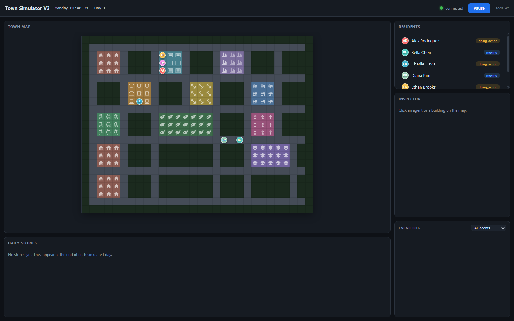

# Multi-Agent Town Story Simulator

**Author:** Erfan Rafieioskouei

A hybrid agent architecture for emergent narrative generation: deterministic **behavior trees with utility arbitration** drive autonomous town residents, while an **LLM performs asynchronous post-hoc narrative cognition** — per-agent diaries, nightly reflection, and a town-wide story — over the simulation's factual event journal. Cognition feeds back into behavior only through a **typed, bounded, validated channel**, so agents gain open-ended character development without ever losing behavioral reliability.

> **V2.0 (this branch)** is a ground-up re-architecture in the `townsim/` package, built from the findings of a full audit of the V1 prototype (53 verified defects — see [`docs/v2_upgrade/V2_UPGRADE_REPORT.md`](docs/v2_upgrade/V2_UPGRADE_REPORT.md)). The V1 prototype and its study artifacts have been removed from the working tree; they remain available in the git history (commits before `MATSS-V2.0`).



---

## V2.0 Quickstart

Requires Python 3.10+.

```bash
git clone <this repo> && cd Multi-Agent-Town-Story-Simulator
python -m venv .venv
.venv\Scripts\activate            # Windows   (Linux/macOS: source .venv/bin/activate)
pip install -r requirements.txt

# Run with the live dashboard at http://127.0.0.1:8000
# (works with or without the venv activated — `python -m townsim` finds
#  <repo>/.venv automatically and re-launches inside it when needed)
python -m townsim serve

# Headless research run: 3 simulated days, no wall-clock pacing
python -m townsim run --days 3 --fast

# Summarize any recorded run
python -m townsim replay runs/run_<stamp>_seed<seed>/journal.jsonl
```

**Every run is different by default.** Each run draws a fresh random seed, which picks the starting weekday and applies a per-agent schedule variation (±1h phase shifts, occasional shortened windows), so no two runs open on the same day with the same routine. The drawn seed is logged and written to the journal header — re-run any interesting run exactly with `--seed <value>` (or pin `kernel.seed` / `kernel.start_weekday` in YAML).

**No API key needed to try it.** Without a key, the system uses a deterministic offline provider (`fake`) that grounds its text in the real event journal. For real narratives, add a key to a `.env` file at the repo root — either provider works:

```bash
# .env  (gitignored — never commit keys)
OPENROUTER_API_KEY=sk-or-v1-...   # any openrouter.ai model, incl. free ones
# or
OPENAI_API_KEY=sk-...             # (the V1 name API_KEY also still works)
```

With `provider: auto` the first available key wins (OpenAI, then OpenRouter, then offline). For OpenRouter free-tier models, create a `townsim.yaml` at the repo root (gitignored) to pin the provider and pace requests under the 16-req/min quota:

```yaml
llm:
  provider: openrouter
  openrouter_model: google/gemma-4-31b-it:free
  openrouter_auto_free_models: true   # default: discover EVERY :free model as backup
  reasoning: true            # OpenRouter reasoning flag
  requests_per_minute: 12    # client-side pacing below the :free quota
  max_attempts: 6
  retry_max_wait_s: 70       # retries can ride out a full quota window
  narrative_drain_timeout_s: 600
```

**Instant fallbacks across the whole free tier.** At startup the provider fetches OpenRouter's model list and keeps every usable `:free` model as a backup (your configured model + `openrouter_fallback_models` stay first in line). Each request carries a routing window of 3 models — OpenRouter falls through the window natively inside one request — and when a whole window is saturated, the next retry rotates to 3 fresh models instead of re-hitting the same exhausted pools. Note the 16-req/min quota is account-wide across all free models; pacing still applies.

Configuration defaults live in [`townsim/config/default.yaml`](townsim/config/default.yaml); any key can also be overridden via environment (`TOWNSIM_KERNEL__SEED=7`, `TOWNSIM_LLM__PROVIDER=fake`, …). All tuning constants (needs rates, wages, thresholds, tick scale) are config, not magic numbers.

### Reproducibility

Every run writes to its own directory under `runs/` (journal, diaries, stories — nothing is ever overwritten). The journal carries a **determinism hash** over all behavioral events:

```bash
python -m townsim run --days 2 --fast --provider fake --seed 42
# -> Determinism hash: identical on every machine, every rerun of that seed
```

Randomness and reproducibility are the same dial: without `--seed`, each run gets a fresh seed (fresh weekday, fresh schedule jitter, fresh needs/wallets); with `--seed`, everything — including the "random" variations — replays exactly.

Same seed → identical behavior, byte for byte, even with the narrative layer enabled (`--strict`, the default for `run`, settles cognition at day rollovers so LLM results land at reproducible sim times).

### Tests

```bash
pip install -r requirements-dev.txt
pytest              # full suite: BT contracts, wrap-around schedules, pathfinding,
                    # memory, bounded reflection, 2-day integration runs, determinism,
                    # free-model pool rotation, per-run randomization, server lifecycle
```

---

## V2.0 Architecture

One process, one source of truth, cognition off the critical path:

```
┌────────────────────────── townsim (single process, asyncio) ──────────────────────────┐
│  ┌───────────────┐   events    ┌──────────────┐   typed intents   ┌──────────────┐    │
│  │ KERNEL        │ ──────────▶ │ JOURNAL      │ ◀──────────────── │ COGNITION    │    │
│  │ fixed timestep│             │ (JSONL, per- │                   │ (async LLM:  │    │
│  │ seeded RNG    │             │  run dirs,   │ ────────────────▶ │ diaries,     │    │
│  │ Schedule      │             │  determinism │   day-end jobs    │ reflection,  │    │
│  │ Needs         │             │  hash)       │                   │ story,       │    │
│  │ Behavior (BT+ │             └──────────────┘                   │ dialogue)    │    │
│  │  UtilitySel.) │                                                └──────┬───────┘    │
│  │ Movement      │   WebSocket deltas   ┌────────────────┐        ┌──────▼───────┐    │
│  │ Interaction   │ ───────────────────▶ │ Dashboard      │        │ LLM GATEWAY  │    │
│  │ Economy       │ ◀─────────────────── │ (self-contained│        │ retry, cache,│    │
│  └───────────────┘   pause / inspect    │  vanilla JS)   │        │ providers    │    │
└─────────────────────────────────────────└────────────────┘────────└──────────────┘────┘
```

| Layer | Module | What it does |
|-------|--------|--------------|
| Kernel | `townsim/kernel/` | Fixed-timestep clock (sim time is a pure function of the tick), per-subsystem seeded RNG streams, append-only event journal with per-run directories, async run loop |
| World | `townsim/world/` | Map + places, spatial-hash proximity queries, A* pathfinding, `WorldState` as single source of truth |
| Behavior | `townsim/behavior/` | Reactive BT runtime; **`UtilitySelector`** scores branches from real state (needs × personality × opportunity), falls back on failure, commits with hysteresis; three-scope blackboard (agent / group / world); location-guard idiom on every "do X somewhere" branch |
| Systems | `townsim/systems.py` | Ordered per-tick logic: wrap-aware schedules, needs, action expiry, movement with universal replanning, single-point conversation mediation with symmetric teardown, charge-once-per-slot economy |
| Cognition | `townsim/cognition/` | Day-indexed episodic memory with recency/importance/relevance retrieval and compaction; nightly **bounded reflection** (mood, clamped utility-weight deltas, grammar-checked schedule proposals); diary → story pipeline with rule-triggered story beats; salient-encounter dialogue rendering |
| LLM | `townsim/llm/` | Provider Protocol (OpenAI / OpenRouter / deterministic offline fake), async gateway with timeouts + exponential-backoff retries + bounded concurrency + client-side pacing, OpenRouter free-model pool with rotating 3-model routing windows, embedding-based semantic cache, versioned Jinja2 prompt templates, Pydantic-validated structured output |
| Server | `townsim/server/` | FastAPI + WebSocket hub (delta updates), REST inspection API, dependency-free dashboard with live BT-path introspection, needs bars, relationships, diaries, stories |

### The bounded feedback channel

The LLM never chooses actions. Each night it reads the day's retrieved memories and returns a `ReflectionResult` — validated by Pydantic, then sanitized again by the kernel: mood, up to 3 insights, up to 3 utility-weight adjustments (clamped to ±0.2, weights bounded to [0.4, 2.0]), up to 2 schedule proposals (checked against the activity grammar). Open-ended cognition, guaranteed-safe behavior — the property that makes this architecture publishable (see the [upgrade report](docs/v2_upgrade/V2_UPGRADE_REPORT.md), §6).

### Why not LLM-in-the-loop?

Compared to Generative-Agents-style systems (Park et al., UIST 2023), where the LLM plans every action:

- **O(1) LLM calls per agent-day** (diary + reflection + shared story) instead of per decision — orders of magnitude cheaper;
- **bit-exact reproducibility** from a seed — impossible with in-loop sampling;
- **auditable narratives**: every generated sentence can be checked against the symbolic ground-truth journal (a hallucination-rate metric pure-LLM simulacra cannot compute, because their "ground truth" is itself LLM output).

---

## Project structure

```
townsim/                 # V2.0 package (see table above; townsim/world/map_data.json is the town map)
tests/                   # pytest suite
prompts/                 # versioned Jinja2 prompt templates (diary, story, reflect, dialogue)
runs/                    # per-run output: journal.jsonl, diaries/, stories/   (gitignored)
docs/v2_upgrade/         # V1 audit report (53 verified findings), V2 design docs, artifacts
```

The V1 prototype (`app.py`/`command.py` two-process Flask-SocketIO version), its 14-day study outputs, and the offline `narrative_analyzer.py` toolkit were removed from the working tree after the V2 rewrite shipped; check out any commit before the `MATSS-V2.0` branch point to run them. Headline numbers from that V1 study (84 diaries over 14 days, 6 agents): mean diary↔story TF-IDF similarity 0.149, stable positive sentiment, clear per-agent behavioral differentiation.

## Research framing

The system is positioned as a **hybrid agentic architecture** contribution: BT/utility behavioral substrate + LLM narrative cognition + bounded feedback, evaluated on behavioral reliability, believability (Park-style interview probes), narrative grounding (claim-level faithfulness against the journal), behavioral diversity, and cost/scalability, with a 4-way ablation (BT-only / LLM-only / hybrid-without-feedback / full). Full academic framing — verified related work, metrics, venues (AIIDE, IEEE CoG, FDG, agent-memory workshops), and paper outline — in [`docs/v2_upgrade/V2_UPGRADE_REPORT.md`](docs/v2_upgrade/V2_UPGRADE_REPORT.md) §6.

**Key references**

- Park et al., *Generative Agents: Interactive Simulacra of Human Behavior*, UIST '23 ([arXiv:2304.03442](https://arxiv.org/abs/2304.03442))
- Orkin, *Three States and a Plan: The A.I. of F.E.A.R.*, GDC 2006
- Mark, *Behavioral Mathematics for Game AI*, 2009; Merrill & Hilburn chapters in *Game AI Pro*, CRC Press 2013
- Wang et al., *Voyager: An Open-Ended Embodied Agent with LLMs*, TMLR 2024 ([arXiv:2305.16291](https://arxiv.org/abs/2305.16291))
- Altera.AL, *Project Sid: Many-agent simulations toward AI civilization*, 2024 ([arXiv:2411.00114](https://arxiv.org/abs/2411.00114))

## License

MIT — see `LICENSE`.

## Acknowledgments

OpenAI & OpenRouter (LLM APIs), FastAPI/Starlette, pydantic, Jinja2, structlog, tenacity, NumPy, pytest & Hypothesis, and Park et al. for the foundational generative-agents work.
